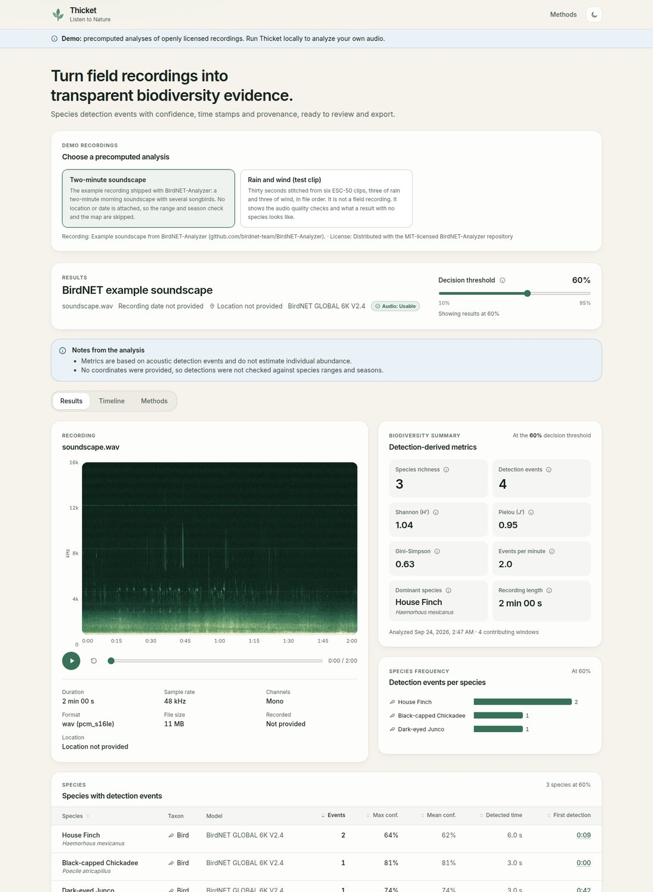
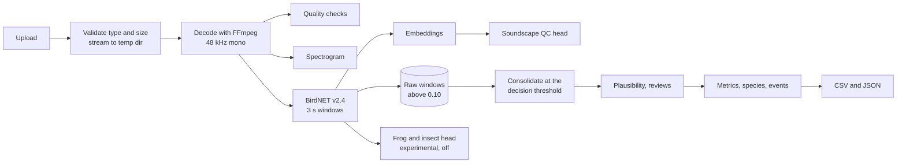

# Thicket

**Listen to Nature.** Thicket turns field recordings into transparent biodiversity evidence: timestamped species detections with confidence, detection-derived diversity metrics, audio quality checks, soundscape indices, and CSV/JSON exports that carry their own provenance.

It is built for the people who have to measure habitat outcomes (land trusts, restoration crews, regenerative farms, easement and carbon projects) and who need results they can check, not a black box.



*Real output: the BirdNET-Analyzer example soundscape analyzed by Thicket at a 0.60 decision threshold (the static demo in `frontend/public/demo`).*

## What it does

1. **Upload** a WAV, MP3, M4A or FLAC clip (up to 10 minutes). Add coordinates, time and a site name if you have them.
2. **Preview** the recording: file facts, a server-rendered spectrogram and quality checks before any model runs.
3. **Detect** with BirdNET v2.4 in 3 s windows. Thicket keeps every window above a 0.10 floor so you can move the threshold later without re-running the model.
4. **Consolidate** adjacent windows of the same species into detection events, check each bird against BirdNET's range and season model, and set aside human voices, engines and other non-wildlife sounds.
5. **Summarize** with species richness, Shannon, Pielou and Gini-Simpson, events per minute and acoustic indices, all from one event set so every number on the page agrees.
6. **Review and export**: accept or reject events, then download CSV (one row per event) or JSON (the full analysis with model versions, hashes, settings and timings).

## Status at a glance

| Capability | Status | Evidence |
|---|---|---|
| Upload, validation, normalization, temp cleanup | Built | 279 backend tests incl. magic-byte sniffing, 413/415 paths, cleanup on failure |
| BirdNET v2.4 detections with timestamps | Built | Adapter contract test on a pinned fixture (chickadee 0.81 at 0 s, house finch 0.64 at 9 s, blue jay at 18 s) |
| Threshold control, consolidation, metrics | Built | Server recomputes at any threshold from stored raw windows; hand-computed metric tests |
| Range and season plausibility (birds) | Built | Uses BirdNET's meta model; never applied to frogs or insects (it scores them near 0) |
| Audio quality control | Built | Signal checks plus a trained soundscape head (below) |
| Acoustic indices (ACI, ADI, AEI, BI, NDSI, Hf, Ht) | Built | Cross-checked against scikit-maad to about 1e-5 |
| Review (accept, reject, correct) | Built | Rejected events leave the metrics; reviews follow the reviewed windows at every threshold |
| CSV and JSON export with provenance | Built | Exact header and schema tests |
| Frontend analysis workspace | Built | 92 unit tests, Playwright e2e with an axe scan in light and dark |
| Soundscape QC head (rain, wind, engines...) | Trained here | ESC-50, 5 official folds, macro AP 0.866 (0.835 to 0.896) |
| Frog and insect species head | Pipeline ready, not trained | No reachable, openly licensed North American data met the bar tonight. See below. |
| Accounts, organizations, long-term site trends | Not built | Release D in the spec |

## Models

| Model | Role | Status | License |
|---|---|---|---|
| **BirdNET GLOBAL 6K v2.4** (Cornell Lab of Ornithology and TU Chemnitz) | Species detector. 6,522 labels: birds plus 41 frogs and toads, 42 insects, 7 mammals, and human, dog, engine, siren and noise classes | Stable, pretrained, not retrained | CC BY-NC-SA 4.0 (non-commercial) |
| **Thicket soundscape QC head v1** | Flags rain, wind, thunder, water, engines and machinery, human non-speech and domestic animals so users know when detections may be unreliable | Trained and evaluated here on BirdNET embeddings of ESC-50 | CC BY-NC-SA 4.0 |
| **Thicket frog and insect head** | Adds species BirdNET does not cover (for example Neotibicen and Magicicada cicadas, leopard frogs, Blanchard's cricket frog) | Off by default behind `FROG_INSECT_ENABLED`; needs the iNaturalist dataset run | n/a until trained |

Model cards: [BirdNET in Thicket](docs/model-cards/birdnet-v2.4.md), [soundscape QC head](docs/model-cards/qc-soundscape-v1.md), [frog and insect head](docs/model-cards/frog-insect.md).

### The QC head, in numbers

A logistic head on frozen BirdNET embeddings, trained with the official ESC-50 folds (hyperparameters, calibration and thresholds chosen on training folds only; 95% intervals from a bootstrap over source recordings):

* 50-class reference probe: **84.4%** accuracy (sd 1.4 over folds).
* Ten QC categories: macro average precision **0.866** (0.835 to 0.896), macro F1 0.800, macro ROC AUC 0.982.
* Using BirdNET's own labels for the same categories reaches macro AP 0.339, so the trained head is better in all ten categories.
* On mixtures it is weaker: with rain 10 dB louder than a bird, frog or insect call it flags the rain 48% of the time. ESC-50 clips are short and curated, so these are not field numbers.

Full report: [ml/reports/qc_esc50_v1.md](ml/reports/qc_esc50_v1.md).

### Why there is no frog and insect species model yet

The historical experiment (an 11-class ResNet18 with a reported "0.849") failed validation and is not reused. Tonight's build environment could reach GitHub and PyPI but not iNaturalist, Zenodo, xeno-canto or Hugging Face, and none of the dozen reachable datasets met the bar (openly licensed, North American, species labeled, at least 15 recordings per class from at least 3 recordists). Every candidate is listed in [ml/reports/data_sources.md](ml/reports/data_sources.md).

What exists instead is the full pipeline, tested end to end:

1. `.github/workflows/dataset-inat.yml` pulls research-grade, CC-licensed iNaturalist sound observations for 17 frogs, 20 crickets, katydids and cicadas, 40 birds and four open-set negative groups, rate limited to iNaturalist's guidance, and stores BirdNET (and optionally Perch 2.0) embeddings, never raw audio.
2. Its `train` job runs `ml/train/frog_insect.py`: observer-grouped splits, two-stage multiple-instance training on weak clip labels, recording-level metrics with observer bootstrap CIs, calibration, open-set false positives, a comparison against BirdNET's own frog and insect labels, and a per-class release bar.
3. A person reads the report and only then enables the head with `FROG_INSECT_ENABLED=true`.

A coarse check of BirdNET's built-in labels on ESC-50 is in [ml/reports/birdnet_nonbird_benchmark.md](ml/reports/birdnet_nonbird_benchmark.md): at 0.60 its amphibian labels catch 16 of 40 frog clips at 0.73 precision, and its insect labels catch 6 of 80 insect clips.

## Quick start

Requirements: Python 3.11 to 3.13, Node 22, FFmpeg.

```bash
make setup          # backend venv with BirdNET weights, frontend npm ci
make dev-backend    # API on http://localhost:8000 (docs at /api/docs)
make dev-frontend   # app on http://localhost:5173, proxies /api to :8000
```

One container serving both:

```bash
docker build -t thicket .
docker run --rm -p 8000:8000 -v thicket-data:/data thicket
```

Command line, no server:

```bash
cd backend && source .venv/bin/activate
python -m thicket.cli analyze recording.wav --lat 42.44 --lon -76.50 \
  --date 2026-05-14T06:30:00 --timezone America/New_York --csv out.csv --json out.json
```

Configuration lives in environment variables; see [.env.example](.env.example) and [backend/README.md](backend/README.md).

## How an analysis works



Rules that keep results honest:

* **One event set.** Richness, diversity, charts, tables and exports all come from the same consolidated events at the recorded threshold. Change the slider and the server recomputes all of it.
* **Events are not animals.** An event is a stretch of audio where a species was detected. One bird can make many events; several can share one. Thicket never reports individuals or abundance.
* **Non-wildlife is not diversity.** Human voice, engines, sirens and noise are reported as other sounds and warnings, not species. A detected human voice raises a privacy note.
* **Unlikely is shown, not hidden.** Birds outside BirdNET's expected range and season for the place and week stay visible, flagged, and out of the metrics.
* **Missing stays missing.** No coordinates means no map and no range check, never a default location.

Metric definitions (with n_i events for species i, N = sum n_i, p_i = n_i / N): richness S; Shannon H' = -sum p_i ln p_i; Pielou J' = H' / ln S when S > 1, else 0; Gini-Simpson 1 - sum p_i^2. They describe how detection events are spread over species, not how many animals are present.

## Repository

```
backend/    FastAPI service, domain logic, model adapters, SQLite persistence, CLI, tests
frontend/   React + TypeScript + Tailwind analysis workspace, demo mode, Vitest + Playwright
ml/         iNaturalist dataset pipeline, training, gold-set benchmark, reports
shared/     api.schema.json, generated from the backend and used to type the frontend
docs/       product spec, decisions, validation protocol, model cards
scripts/    publish.sh
```

## Tests

```bash
make lint     # ruff, frontend eslint and typecheck
make test     # backend pytest (279), ml tests (14), frontend vitest (92)
make e2e      # Playwright with a mocked API, including an axe accessibility scan
```

CI (`.github/workflows/ci.yml`) runs the same checks plus schema and generated-type freshness.

## Deploy

* **GitHub**: `./scripts/publish.sh` creates the repository with the GitHub CLI, pushes it, and turns on the Pages demo.
* **Single container** on Render (`render.yaml`) or Fly (`fly.toml`): one CPU instance with at least 2 GB RAM, one worker so BirdNET loads once.
* **Static demo** on GitHub Pages (`.github/workflows/pages.yml`): the frontend in demo mode with precomputed analyses.
* Before a real pilot: set `ALLOWED_ORIGINS`, keep `RETAIN_AUDIO=false` unless participants agreed otherwise, and read [docs/DECISIONS.md](docs/DECISIONS.md).

## What is not built

* No accounts, organizations or roles; the pilot is single user and local.
* No object storage or Postgres deployment yet (SQLite and local disk, behind interfaces).
* No site, deployment or protocol objects, so no longitudinal trends or before/after comparisons yet.
* No site-specific expert gold set yet, so no field precision or recall claims for any model. The protocol and the benchmark tool are ready: [docs/VALIDATION.md](docs/VALIDATION.md).
* No frog and insect species model (see above).
* No PDF evidence package, batch ingestion or recorder integrations.
* Not deployed to a public host; the repo includes the configs to do it.

## Licenses

Code: MIT. BirdNET weights and everything derived from them (embeddings, the QC head): CC BY-NC-SA 4.0, so commercial use needs a license from the BirdNET team. Datasets keep their own licenses. Details in [MODEL_LICENSES.md](MODEL_LICENSES.md).

## Credits

BirdNET by the K. Lisa Yang Center for Conservation Bioacoustics at the Cornell Lab of Ornithology and Chemnitz University of Technology. ESC-50 by Karol J. Piczak. Acoustic index definitions from Pieretti et al. (2011), Villanueva-Rivera et al. (2011), Boelman et al. (2007), Kasten et al. (2012) and Sueur et al. (2008).
