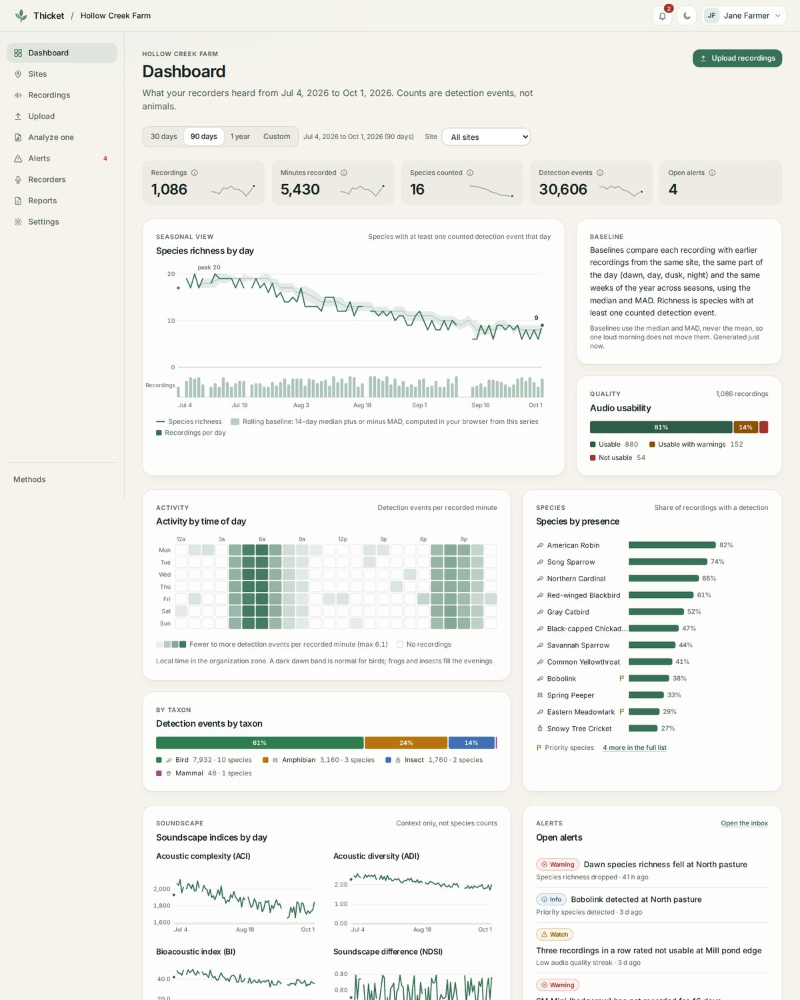
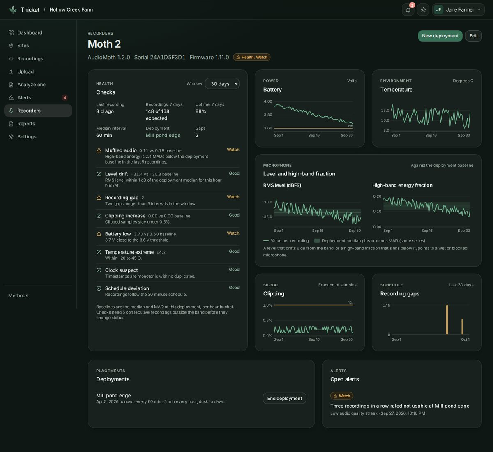
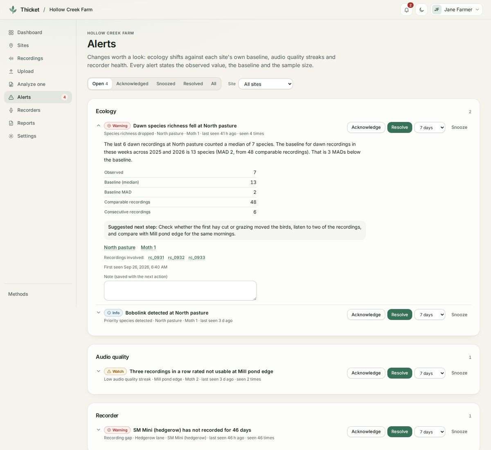
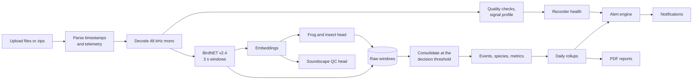

# Thicket

**Listen to Nature.** Thicket is a biodiversity monitoring platform for farms, ranches and land stewards. Recorders in the field produce audio; Thicket turns it into species detections you can check, seasonal trends per site, alerts when something looks off (for the wildlife or for the microphone), and PDF evidence packages shaped for the programs that pay for conservation work.



**Try the demo:** https://thicket-chi.vercel.app (sample farm, read-only).

*Farm dashboard with sample data: richness by day against a rolling baseline, activity by time of day, species presence, taxon split, soundscape indices, audio quality and open alerts.*

## What a farm gets

* **Sign in with Google**, one workspace per farm or project, with owner, manager, reviewer and viewer roles and email invites.
* **Sites, recorders and deployments.** Each recorder placement is tracked with its schedule, height and gain.
* **Bulk uploads straight from SD cards**: many files or zips from AudioMoth, Song Meter, phones or handheld recorders. Timestamps come from file names or file metadata; battery and temperature come from AudioMoth comments, GUANO and Song Meter summary files.
* **Two models on every recording**: BirdNET v2.4 for birds (plus its frog and insect labels), and Thicket's own frog and insect head for 30 Northeastern species, including cicadas and leopard frogs BirdNET cannot name. Each call is counted once.
* **History and seasons**: a dashboard per farm and per site, a phenology ribbon (which weeks each species shows up, year over year), species accumulation curves, and site comparisons.
* **Alerts with reasons.** Thicket compares each site with its own past (same time of day, same weeks of the year, median and MAD) and flags richness or activity drops, expected species gone missing, priority species detected, new species, and runs of unusable audio.
* **Recorder health**: muffled microphones (high frequencies fading), level drift, clipping, gaps inside the recording schedule, low battery, temperature extremes, clock problems. Each one comes with a plain-language fix.
* **Notifications** in the app and by email (immediate or daily/weekly digest).
* **PDF reports** in five formats: a general evidence package, an NRCS EQIP/CSP practice annex, a NY AEM Tier 5 annex, a certification monitoring summary (ROC, Land to Market, Audubon), and a biodiversity credit monitoring report (Verra CCB, Plan Vivo, TNFD-aligned). [docs/REPORTING.md](docs/REPORTING.md) documents what each program actually accepts.
* **Single-recording analysis** with playback, spectrogram, timeline, review and CSV/JSON export, as before.

| Recorder health | Alerts |
|---|---|
|  |  |

## Models

| Model | What it does | Evidence | License |
|---|---|---|---|
| **BirdNET GLOBAL 6K v2.4** (Cornell Lab of Ornithology, TU Chemnitz) | 6,522 labels: birds, plus 41 frogs and toads, 42 insects, 7 mammals and non-wildlife sounds | Pretrained, used as published; range and season filter applied to birds only | CC BY-NC-SA 4.0 |
| **Thicket frog and insect head v1** | 30 frogs, toads, crickets, katydids and cicadas of the Northeast and Midwest | Test macro AP **0.794** (0.770 to 0.838) on observer-disjoint iNaturalist data; **+0.155** macro AP over BirdNET's own labels on 27 shared species | CC BY-NC-SA 4.0 |
| **Thicket soundscape QC head v1** | Flags rain, wind, thunder, water, engines, human sounds and domestic animals | ESC-50 official folds, macro AP **0.866** (0.835 to 0.896) vs 0.339 for BirdNET's labels | CC BY-NC-SA 4.0 |

Model cards: [BirdNET in Thicket](docs/model-cards/birdnet-v2.4.md), [frog and insect head](docs/model-cards/frog-insect.md), [soundscape QC head](docs/model-cards/qc-soundscape-v1.md).

### The frog and insect head

* **Data**: 9,060 research-grade, Creative Commons iNaturalist recordings from about 4,000 observers. They cover 17 frogs and toads and 20 Orthoptera and cicadas, plus 40 birds and four open-set groups (other frogs, Orthoptera, cicadas, mammals) that the head must not fire on.
* **Model**: a calibrated logistic head on BirdNET embeddings. Splits are by observer, so nobody's recordings appear in both training and test. Thresholds and temperature come from validation only.
* **Release bar**: at least 10 test recordings from 3 or more observers, an AP lower bound of at least 0.5, and no worse than BirdNET on shared species. 30 of 36 classes pass.
* **Withheld**: Spring Peeper (AP 0.62, too uncertain) and five small classes. BirdNET still reports peepers.
* **Known weakness**: about a quarter of recordings of *unlisted* frogs and Orthoptera trigger a false match. These are iNaturalist numbers, not field numbers.

Full report: [ml/reports/frog_insect_v1.md](ml/reports/frog_insect_v1.md).

## Quick start

Requirements: Python 3.11 to 3.13, Node 22, FFmpeg.

```bash
make setup          # backend venv with BirdNET weights, frontend npm ci
make dev-backend    # API on http://localhost:8000 (docs at /api/docs)
make dev-frontend   # app on http://localhost:5173, proxies /api to :8000
```

Locally there is no sign-in (`AUTH_MODE=disabled`): everything lands in one "Local workspace". To try accounts, set `AUTH_MODE=dev` (email-only sign-in for development) or `AUTH_MODE=google` (see [backend/README.md](backend/README.md), accounts and Google sign-in).

Load a folder of recorder files from the command line:

```bash
cd backend && source .venv/bin/activate
python -m thicket.cli ingest /path/to/SD_CARD --site "North pasture" --recorder "Moth 1" --timezone America/New_York
python -m thicket.cli analyze recording.wav --lat 42.44 --lon -76.50 --date 2026-05-14T06:30:00 --json out.json
```

One container serving both the API and the app:

```bash
make docker-build && make docker-run     # http://127.0.0.1:8000
```

## How it works



Rules that keep results honest:

* **One event set.** Richness, diversity, charts, tables, rollups, alerts and reports all come from the same consolidated events at the recorded threshold.
* **Events are not animals.** An event is a stretch of audio where a species was detected. Thicket never reports individuals or abundance.
* **Each call counts once.** When both models can name a species, the frog and insect head decides, because it tested better. BirdNET's windows stay visible as raw detections.
* **Baselines before alerts.** Ecology alerts wait until a site has enough comparable recordings, and every alert states the observed value, the baseline and the sample size.
* **Missing stays missing.** No coordinates means no map and no range check, never a default location.
* **Reports never certify.** They provide supporting evidence. Wording that claims compliance, absence or credits is banned and tested for ([docs/REPORTING.md](docs/REPORTING.md) section 8).

## Repository

```
backend/    FastAPI service: analysis pipeline, platform (auth, orgs, ingest, rollups, alerts,
            health, notifications, reports), SQLite or Postgres, CLI, tests
frontend/   React + TypeScript + Tailwind app: dashboard, sites, uploads, alerts, recorders,
            reports, single-recording workspace, demo mode, Vitest + Playwright
ml/         iNaturalist dataset pipeline, frog/insect and QC training, gold-set benchmark, reports
shared/     api.schema.json, generated from the backend and used to type the frontend
docs/       product spec, platform API, reporting research, decisions, validation, model cards
```

## Tests

```bash
make lint     # ruff, eslint, typecheck
make test     # backend pytest (655), ml tests (14), frontend vitest (137)
make e2e      # Playwright (21) with a mocked API, including axe scans in both themes
```

## Deploy

* **GitHub**: `./scripts/publish.sh` creates the repository with the GitHub CLI, pushes it, and turns on the Pages demo.
* **Vercel (read-only demo)**: live at https://thicket-chi.vercel.app. Import the repository with Root Directory `frontend` and set `VITE_DEMO_MODE=true`; the build serves the sample farm from `frontend/public/demo/platform.json` (regenerate it with `npm run demo:platform`). Vercel hosts the web app only. The API needs FFmpeg, the BirdNET weights, a persistent database and background jobs, so it runs on Fly or Render; to put a Vercel build in front of it, drop `VITE_DEMO_MODE` and proxy `/api/*` to the API with a rewrite in `frontend/vercel.json`, so sign-in cookies stay on one origin (they are `SameSite=Lax`, so a separate API domain would not receive them).
* **Fly or Render**: `fly.toml` and `render.yaml` run one container with Google sign-in. Set `GOOGLE_CLIENT_ID`, `GOOGLE_CLIENT_SECRET`, `SESSION_SECRET`, `PUBLIC_BASE_URL` and, for email, `SMTP_*` or `RESEND_API_KEY`. Production refuses to start without sign-in.
* Before a real pilot: keep `RETAIN_AUDIO=false` unless participants agreed otherwise, run the [validation protocol](docs/VALIDATION.md) at the site, and read [docs/DECISIONS.md](docs/DECISIONS.md).

## What is not built

* No site-specific expert gold set yet, so there are no field precision or recall claims for any model. The protocol and benchmark tool are ready.
* No live recorder links (cellular or Wi-Fi); recordings arrive as SD card uploads.
* No object storage backend yet (local disk behind an interface); Postgres is supported by the schema but not exercised in CI.
* No survey protocol objects or before/after study designs beyond baseline periods in reports.
* Only the read-only demo is public (Vercel and GitHub Pages). The API with sign-in is not deployed yet; `fly.toml` and `render.yaml` are ready.

## Licenses

Code: MIT. BirdNET weights and everything derived from them (embeddings, both Thicket heads): CC BY-NC-SA 4.0, so commercial use needs a license from the BirdNET team. Training data keeps its own licenses with per-recording attribution. Details in [MODEL_LICENSES.md](MODEL_LICENSES.md).

## Credits

BirdNET by the K. Lisa Yang Center for Conservation Bioacoustics at the Cornell Lab of Ornithology and Chemnitz University of Technology. Training audio from iNaturalist observers under Creative Commons licenses (attribution in the dataset manifest). ESC-50 by Karol J. Piczak. Acoustic index definitions from Pieretti et al. (2011), Villanueva-Rivera et al. (2011), Boelman et al. (2007), Kasten et al. (2012) and Sueur et al. (2008).
