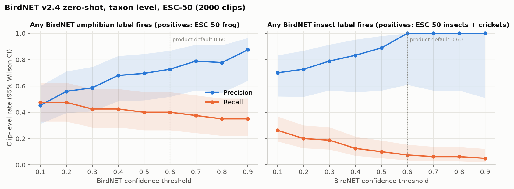

# BirdNET v2.4 non-bird labels: coarse benchmark on ESC-50

Generated by `ml/train/birdnet_nonbird_benchmark.py` on 2026-09-24. Raw numbers: `ml/reports/birdnet_nonbird_results.json`.

## What this measures and what it does not

* BirdNET v2.4 has 41 amphibian and 42 insect labels, mostly North American species (plus, for example, the honey bee).
* ESC-50 has a `frog` class (40 clips), an `insects` class (40 clips; the ESC-50 README calls it 'Insects (flying)') and a `crickets` class (40 clips). They are not species labeled and we do not know where they were recorded, so many are probably not North American species.
* So this is a **taxon-level** check: does any amphibian (or insect) label fire on a frog (or insect) clip, and how often do those labels fire on the other 1,960 (or 1,920) clips? It says nothing about species-level accuracy.
* Clip score = highest probability over all labels of the taxon and over the three 3 s windows (1 s hop) of each 5 s clip. The product uses a 3 s hop, which gives fewer chances to fire, so recall here is an upper bound for the product setting. We also report recall with the first window only.
* BirdNET model sha256 `55f3e4055b1a13bfa9a2452731d0d34f6a02d6b775a334362665892794165e4c`; ESC-50 commit `33c8ce9eb2cf0b1c2f8bcf322eb349b6be34dbb6`. 95% CIs: Wilson intervals for rates; cluster bootstrap over source recordings (1000 resamples) for AP and ROC AUC.

## Amphibian labels

Positives: ESC-50 frog (40 clips). Negatives: all other classes (1960 clips). BirdNET labels in this taxon: 41.

* Average precision 0.469 (0.222 to 0.700); ROC AUC 0.801 (0.693 to 0.899).
* Median clip score: 0.063 on positives, 0.0009 on negatives.

| Threshold | Precision | Recall | Recall, first window only | False positive rate | Most common false positive classes |
|---|---|---|---|---|---|
| 0.1 | 0.45 (0.31 to 0.60; 19/42) | 0.47 (0.33 to 0.63; 19/40) | 0.47 (0.33 to 0.63; 19/40) | 0.01 (0.01 to 0.02; 23/1960) | cow (10), sheep (7), chainsaw (2), laughing (1), crickets (1) |
| 0.2 | 0.56 (0.39 to 0.71; 19/34) | 0.47 (0.33 to 0.63; 19/40) | 0.45 (0.31 to 0.60; 18/40) | 0.01 (0.00 to 0.01; 15/1960) | cow (7), sheep (4), chainsaw (1), laughing (1), crickets (1) |
| 0.3 | 0.59 (0.41 to 0.74; 17/29) | 0.42 (0.29 to 0.58; 17/40) | 0.40 (0.26 to 0.55; 16/40) | 0.01 (0.00 to 0.01; 12/1960) | cow (7), sheep (2), laughing (1), crickets (1), airplane (1) |
| 0.4 | 0.68 (0.48 to 0.83; 17/25) | 0.42 (0.29 to 0.58; 17/40) | 0.40 (0.26 to 0.55; 16/40) | 0.00 (0.00 to 0.01; 8/1960) | cow (4), laughing (1), crickets (1), airplane (1), sheep (1) |
| 0.5 | 0.70 (0.49 to 0.84; 16/23) | 0.40 (0.26 to 0.55; 16/40) | 0.40 (0.26 to 0.55; 16/40) | 0.00 (0.00 to 0.01; 7/1960) | cow (4), laughing (1), crickets (1), sheep (1) |
| 0.6 | 0.73 (0.52 to 0.87; 16/22) | 0.40 (0.26 to 0.55; 16/40) | 0.38 (0.24 to 0.53; 15/40) | 0.00 (0.00 to 0.01; 6/1960) | cow (3), laughing (1), crickets (1), sheep (1) |
| 0.7 | 0.79 (0.57 to 0.91; 15/19) | 0.38 (0.24 to 0.53; 15/40) | 0.38 (0.24 to 0.53; 15/40) | 0.00 (0.00 to 0.01; 4/1960) | laughing (1), crickets (1), sheep (1), cow (1) |
| 0.8 | 0.78 (0.55 to 0.91; 14/18) | 0.35 (0.22 to 0.50; 14/40) | 0.35 (0.22 to 0.50; 14/40) | 0.00 (0.00 to 0.01; 4/1960) | laughing (1), crickets (1), sheep (1), cow (1) |
| 0.9 | 0.88 (0.64 to 0.97; 14/16) | 0.35 (0.22 to 0.50; 14/40) | 0.30 (0.18 to 0.45; 12/40) | 0.00 (0.00 to 0.00; 2/1960) | laughing (1), crickets (1) |

Labels that fire most often on the positives (highest label per clip, score >= 0.1): `Hyliola regilla_Pacific Chorus Frog` (14), `Dryophytes versicolor_Gray Treefrog` (2), `Pseudacris feriarum_Upland Chorus Frog` (2), `Dryophytes cinereus_Green Treefrog` (1).

BirdNET's single top label per positive clip, by taxon: frog: bird 20, amphibian 19, anthropogenic 1.

## Insect labels

Positives: ESC-50 insects, crickets (80 clips). Negatives: all other classes (1920 clips). BirdNET labels in this taxon: 42.

* Average precision 0.442 (0.312 to 0.570); ROC AUC 0.886 (0.839 to 0.928).
* Median clip score: 0.019 on positives, 0.0004 on negatives.

| Threshold | Precision | Recall | Recall on insects | Recall on crickets | Recall, first window only | False positive rate | Most common false positive classes |
|---|---|---|---|---|---|---|---|
| 0.1 | 0.70 (0.52 to 0.83; 21/30) | 0.26 (0.18 to 0.37; 21/80) | 0.20 (0.10 to 0.35; 8/40) | 0.33 (0.20 to 0.48; 13/40) | 0.24 (0.16 to 0.34; 19/80) | 0.00 (0.00 to 0.01; 9/1920) | mouse_click (4), airplane (1), keyboard_typing (1), water_drops (1), toilet_flush (1) |
| 0.2 | 0.73 (0.52 to 0.87; 16/22) | 0.20 (0.13 to 0.30; 16/80) | 0.15 (0.07 to 0.29; 6/40) | 0.25 (0.14 to 0.40; 10/40) | 0.20 (0.13 to 0.30; 16/80) | 0.00 (0.00 to 0.01; 6/1920) | mouse_click (4), keyboard_typing (1), water_drops (1) |
| 0.3 | 0.79 (0.57 to 0.91; 15/19) | 0.19 (0.12 to 0.29; 15/80) | 0.15 (0.07 to 0.29; 6/40) | 0.23 (0.12 to 0.38; 9/40) | 0.14 (0.08 to 0.23; 11/80) | 0.00 (0.00 to 0.01; 4/1920) | mouse_click (3), water_drops (1) |
| 0.4 | 0.83 (0.55 to 0.95; 10/12) | 0.12 (0.07 to 0.22; 10/80) | 0.03 (0.00 to 0.13; 1/40) | 0.23 (0.12 to 0.38; 9/40) | 0.09 (0.04 to 0.17; 7/80) | 0.00 (0.00 to 0.00; 2/1920) | mouse_click (1), water_drops (1) |
| 0.5 | 0.89 (0.56 to 0.98; 8/9) | 0.10 (0.05 to 0.19; 8/80) | 0.00 (0.00 to 0.09; 0/40) | 0.20 (0.10 to 0.35; 8/40) | 0.07 (0.03 to 0.15; 6/80) | 0.00 (0.00 to 0.00; 1/1920) | water_drops (1) |
| 0.6 | 1.00 (0.61 to 1.00; 6/6) | 0.07 (0.03 to 0.15; 6/80) | 0.00 (0.00 to 0.09; 0/40) | 0.15 (0.07 to 0.29; 6/40) | 0.06 (0.03 to 0.14; 5/80) | 0.00 (0.00 to 0.00; 0/1920) | none |
| 0.7 | 1.00 (0.57 to 1.00; 5/5) | 0.06 (0.03 to 0.14; 5/80) | 0.00 (0.00 to 0.09; 0/40) | 0.12 (0.05 to 0.26; 5/40) | 0.06 (0.03 to 0.14; 5/80) | 0.00 (0.00 to 0.00; 0/1920) | none |
| 0.8 | 1.00 (0.57 to 1.00; 5/5) | 0.06 (0.03 to 0.14; 5/80) | 0.00 (0.00 to 0.09; 0/40) | 0.12 (0.05 to 0.26; 5/40) | 0.06 (0.03 to 0.14; 5/80) | 0.00 (0.00 to 0.00; 0/1920) | none |
| 0.9 | 1.00 (0.51 to 1.00; 4/4) | 0.05 (0.02 to 0.12; 4/80) | 0.00 (0.00 to 0.09; 0/40) | 0.10 (0.04 to 0.23; 4/40) | 0.04 (0.01 to 0.10; 3/80) | 0.00 (0.00 to 0.00; 0/1920) | none |

Labels that fire most often on the positives (highest label per clip, score >= 0.1): `Apis mellifera_Honey Bee` (8), `Oecanthus nigricornis_Blackhorned Tree Cricket` (2), `Amblycorypha oblongifolia_Oblong-winged Katydid` (1), `Neoconocephalus ensiger_Sword-bearing Conehead` (1), `Microcentrum rhombifolium_Greater Angle-wing` (1), `Neoconocephalus retusus_Round-tipped Conehead` (1), `Gryllus pennsylvanicus_Fall Field Cricket` (1), `Oecanthus quadripunctatus_Four-spotted Tree Cricket` (1).

BirdNET's single top label per positive clip, by taxon: insects: bird 16, insect 8, anthropogenic 8, human 7, mammal 1; crickets: bird 21, insect 17, anthropogenic 1, amphibian 1.

## Smoke check on one North American toad recording

`great_plains_toad.wav` from the OpenSoundscape test suite (MIT-licensed repository; recordist unknown), 44.57 s, 15 windows. This is one file: an anecdote, not evidence.

* Great Plains Toad (*Anaxyrus cognatus*) max probability: 0.158; highest amphibian label: 0.410.
* Top 5 labels (max over windows): `Dryophytes femoralis_Pine Woods Treefrog` 0.410 (amphibian); `Campylorhynchus brunneicapillus_Cactus Wren` 0.358 (bird); `Icteria virens_Yellow-breasted Chat` 0.164 (bird); `Anaxyrus cognatus_Great Plains Toad` 0.158 (amphibian); `Mimus gilvus_Tropical Mockingbird` 0.057 (bird).

## Reading the results

* Amphibian, at the product default 0.60: recall 0.40 (frog 16/40), precision 0.73, 6 false positives among 1960 other clips. BirdNET's single top label is a bird label on 20 of 40 positive clips.
* Amphibian: at 0.5, recall 0.40 with precision 0.70; at 0.1, recall 0.47 with precision 0.45 and 23 false positives among 1960 negatives.
* Insect, at the product default 0.60: recall 0.07 (insects 0/40; crickets 6/40), precision 1.00, 0 false positives among 1920 other clips. BirdNET's single top label is a bird label on 37 of 80 positive clips.
* Insect: at 0.5, recall 0.10 with precision 0.89; at 0.1, recall 0.26 with precision 0.70 and 9 false positives among 1920 negatives.

## Limits

* ESC-50 clips are short, curated Freesound clips, often recorded close to the source. Field recordings are harder.
* A taxon-level hit does not mean the species is right. A species-level benchmark needs species-labeled North American recordings from many recordists; see `ml/reports/data_sources.md` for why we could not run one here and `ml/train/frog_insect.py` for the pipeline that will run on the iNaturalist feature dataset.
* BirdNET may have been trained on some of the same Freesound or xeno-canto source recordings that ESC-50 uses. We cannot check this, so these numbers may be optimistic.
