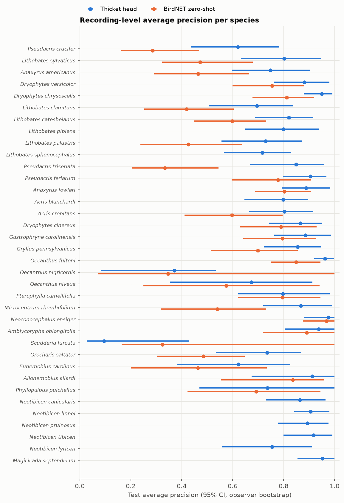
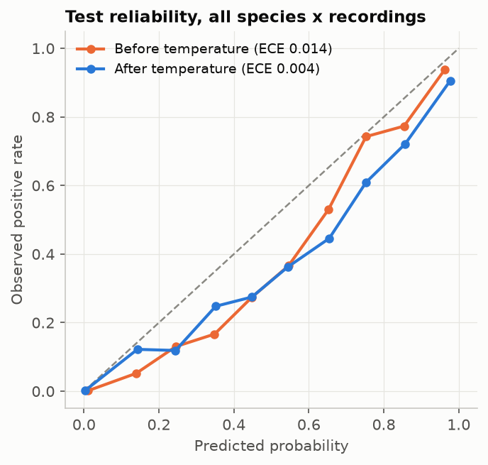

# Frog and insect head v1: evaluation report

Generated by `ml/train/frog_insect.py` on 2026-10-01 from the thicket-inat-v1 feature dataset (manifest sha256 below). All numbers below come from `results.json` in the same folder.

## Pre-metric checks

| Check | Status | Detail |
|---|---|---|
| run parameters | pass | split [0.7, 0.15, 0.15], seed 20260924, rms floor -60.0 dBFS, top-k 3, model linear, C grid [0.001, 0.003, 0.01, 0.03, 0.1] |
| manifest integrity | warn | dropped 42 recordings whose audio bytes duplicate another recording |
| label-set compatibility | pass | all 37 config targets present |
| model identity | pass | 2 parts, 1024-d embeddings, 140 subset labels match BirdNET v2.4 (verified against local weights sha256 55f3e4055b1a); parts carry no weights hash, so identity rests on the label space |
| manifest integrity | pass | 9060 manifest rows, 9016 usable recordings, 58173 windows; counts match |
| observer-disjoint split | pass | 3998 observers, no observer in two splits |
| label-set compatibility | warn | 1 classes have fewer than 10 training recordings and are not modeled: ['Neoconocephalus robustus'] |

Manifest sha256 `022ea283ac75f9d7d7d57acc8365970ec155752362d9893414c54d598ec2cea2`. RMS floor -60.0 dBFS kept 56903 of 58173 windows (78 recordings kept only their loudest window).

## Data and splits

Splits are grouped by iNaturalist observer (`user_id`) and stratified by label: no observer contributes to two splits. Labels are clip level and weak.

| Class | Train rec. | Val rec. | Test rec. | Test observers |
|---|---|---|---|---|
| Pseudacris crucifer | 154 | 33 | 33 | 25 |
| Lithobates sylvaticus | 154 | 33 | 33 | 24 |
| Anaxyrus americanus | 153 | 33 | 33 | 24 |
| Dryophytes versicolor | 154 | 33 | 33 | 30 |
| Dryophytes chrysoscelis | 152 | 33 | 33 | 28 |
| Lithobates clamitans | 154 | 33 | 33 | 28 |
| Lithobates catesbeianus | 151 | 33 | 33 | 28 |
| Lithobates pipiens | 154 | 33 | 33 | 24 |
| Lithobates palustris | 153 | 32 | 32 | 22 |
| Lithobates sphenocephalus | 154 | 33 | 33 | 23 |
| Pseudacris triseriata | 154 | 33 | 33 | 21 |
| Pseudacris feriarum | 149 | 33 | 33 | 24 |
| Anaxyrus fowleri | 153 | 32 | 33 | 24 |
| Acris blanchardi | 151 | 32 | 33 | 20 |
| Acris crepitans | 154 | 33 | 33 | 26 |
| Dryophytes cinereus | 153 | 33 | 33 | 27 |
| Gastrophryne carolinensis | 152 | 33 | 32 | 24 |
| Gryllus pennsylvanicus | 154 | 33 | 33 | 22 |
| Oecanthus fultoni | 154 | 33 | 33 | 24 |
| Oecanthus nigricornis | 15 | 4 | 4 | 3 |
| Oecanthus niveus | 42 | 9 | 9 | 7 |
| Pterophylla camellifolia | 154 | 33 | 33 | 26 |
| Microcentrum rhombifolium | 154 | 33 | 33 | 22 |
| Neoconocephalus ensiger | 76 | 16 | 15 | 10 |
| Amblycorypha oblongifolia | 68 | 14 | 13 | 9 |
| Scudderia furcata | 11 | 2 | 2 | 2 |
| Orocharis saltator | 154 | 33 | 33 | 21 |
| Eunemobius carolinus | 83 | 17 | 17 | 11 |
| Allonemobius allardi | 65 | 13 | 15 | 10 |
| Phyllopalpus pulchellus | 44 | 9 | 9 | 7 |
| Neotibicen canicularis | 154 | 33 | 33 | 26 |
| Neotibicen linnei | 153 | 33 | 33 | 22 |
| Neotibicen pruinosus | 154 | 33 | 33 | 25 |
| Neotibicen tibicen | 154 | 33 | 33 | 23 |
| Neotibicen lyricen | 153 | 33 | 33 | 18 |
| Magicicada septendecim | 154 | 33 | 33 | 18 |
| [negative] bird | 816 | 174 | 174 |  |
| [negative] other_anura | 275 | 59 | 58 |  |
| [negative] other_orthoptera | 278 | 60 | 60 |  |
| [negative] other_cicadas | 105 | 22 | 23 |  |
| [negative] mammals | 140 | 30 | 30 |  |

Not modeled (too few training recordings): Neoconocephalus robustus.

## Model selection (validation only)

* Stage 1 (all windows, clip labels): C = 0.001, val macro AP by C: 0.001: 0.790, 0.003: 0.782, 0.01: 0.774, 0.03: 0.753, 0.1: 0.728.
* Stage 2 (multiple-instance, top 3 windows per positive recording, 23104 windows): C = 0.003, val macro AP by C: 0.001: 0.786, 0.003: 0.786, 0.01: 0.778, 0.03: 0.769, 0.1: 0.756.
* Chosen on validation: **stage1** (val macro AP stage 1 0.790, stage 2 0.786). Temperature 0.685; per-class thresholds maximize validation F1.

## Test results (stage1, recording level = max over windows)

95% CIs resample observers (cluster bootstrap).

| Species | Test positives | AP | ROC AUC | Precision | Recall | F1 |
|---|---|---|---|---|---|---|
| *Pseudacris crucifer* | 33 | 0.621 (0.436 to 0.783) | 0.971 (0.953 to 0.989) | 0.514 (0.333 to 0.697) | 0.545 (0.345 to 0.759) | 0.529 (0.361 to 0.688) |
| *Lithobates sylvaticus* | 33 | 0.802 (0.632 to 0.949) | 0.985 (0.965 to 0.999) | 0.885 (0.737 to 1.000) | 0.697 (0.517 to 0.902) | 0.780 (0.623 to 0.903) |
| *Anaxyrus americanus* | 33 | 0.748 (0.597 to 0.903) | 0.993 (0.986 to 0.998) | 0.714 (0.545 to 0.875) | 0.758 (0.585 to 0.927) | 0.735 (0.571 to 0.865) |
| *Dryophytes versicolor* | 33 | 0.881 (0.761 to 0.980) | 0.998 (0.995 to 0.999) | 0.857 (0.756 to 0.966) | 0.909 (0.800 to 1.000) | 0.882 (0.794 to 0.952) |
| *Dryophytes chrysoscelis* | 33 | 0.950 (0.879 to 0.991) | 0.999 (0.997 to 1.000) | 0.917 (0.810 to 1.000) | 0.667 (0.500 to 0.824) | 0.772 (0.630 to 0.881) |
| *Lithobates clamitans* | 33 | 0.695 (0.507 to 0.837) | 0.979 (0.962 to 0.991) | 0.690 (0.474 to 0.864) | 0.606 (0.414 to 0.778) | 0.645 (0.480 to 0.781) |
| *Lithobates catesbeianus* | 33 | 0.821 (0.689 to 0.917) | 0.956 (0.901 to 0.991) | 0.828 (0.679 to 0.947) | 0.727 (0.555 to 0.865) | 0.774 (0.615 to 0.886) |
| *Lithobates pipiens* | 33 | 0.799 (0.650 to 0.938) | 0.988 (0.975 to 0.998) | 0.684 (0.513 to 0.833) | 0.788 (0.645 to 0.923) | 0.732 (0.593 to 0.847) |
| *Lithobates palustris* | 32 | 0.730 (0.556 to 0.872) | 0.965 (0.928 to 0.993) | 1.000 (1.000 to 1.000) | 0.594 (0.414 to 0.769) | 0.745 (0.596 to 0.864) |
| *Lithobates sphenocephalus* | 33 | 0.716 (0.566 to 0.829) | 0.970 (0.945 to 0.987) | 0.800 (0.625 to 0.944) | 0.606 (0.474 to 0.750) | 0.690 (0.564 to 0.793) |
| *Pseudacris triseriata* | 33 | 0.849 (0.669 to 0.958) | 0.990 (0.978 to 0.999) | 0.730 (0.542 to 0.885) | 0.818 (0.640 to 0.974) | 0.771 (0.621 to 0.884) |
| *Pseudacris feriarum* | 33 | 0.905 (0.797 to 0.968) | 0.997 (0.994 to 0.999) | 0.682 (0.486 to 0.829) | 0.909 (0.815 to 1.000) | 0.779 (0.649 to 0.874) |
| *Anaxyrus fowleri* | 33 | 0.888 (0.793 to 0.983) | 0.976 (0.933 to 0.999) | 0.844 (0.714 to 0.957) | 0.818 (0.677 to 0.950) | 0.831 (0.733 to 0.920) |
| *Acris blanchardi* | 33 | 0.798 (0.646 to 0.896) | 0.993 (0.988 to 0.997) | 0.750 (0.524 to 0.909) | 0.545 (0.345 to 0.703) | 0.632 (0.461 to 0.750) |
| *Acris crepitans* | 33 | 0.803 (0.665 to 0.916) | 0.976 (0.932 to 0.997) | 0.676 (0.485 to 0.833) | 0.697 (0.500 to 0.857) | 0.687 (0.533 to 0.822) |
| *Dryophytes cinereus* | 33 | 0.866 (0.743 to 0.951) | 0.995 (0.991 to 0.999) | 0.757 (0.605 to 0.882) | 0.848 (0.697 to 0.970) | 0.800 (0.676 to 0.892) |
| *Gastrophryne carolinensis* | 32 | 0.885 (0.763 to 0.986) | 0.996 (0.989 to 1.000) | 0.824 (0.721 to 0.939) | 0.875 (0.767 to 0.971) | 0.848 (0.767 to 0.927) |
| *Gryllus pennsylvanicus* | 33 | 0.854 (0.723 to 0.948) | 0.996 (0.993 to 0.999) | 0.719 (0.545 to 0.867) | 0.697 (0.478 to 0.882) | 0.708 (0.554 to 0.817) |
| *Oecanthus fultoni* | 33 | 0.962 (0.920 to 0.998) | 0.999 (0.997 to 1.000) | 0.879 (0.775 to 1.000) | 0.879 (0.750 to 0.971) | 0.879 (0.800 to 0.951) |
| *Oecanthus nigricornis* | 4 | 0.371 (0.083 to 0.534) | 0.974 (0.949 to 0.997) | 1.000 (1.000 to 1.000) | 0.250 (0.000 to 0.500) | 0.400 (0.000 to 0.667) |
| *Oecanthus niveus* | 9 | 0.673 (0.354 to 0.913) | 0.996 (0.991 to 0.999) | 0.500 (0.200 to 0.818) | 0.778 (0.500 to 1.000) | 0.609 (0.308 to 0.833) |
| *Pterophylla camellifolia* | 33 | 0.797 (0.622 to 0.981) | 0.996 (0.991 to 1.000) | 0.705 (0.526 to 0.927) | 0.939 (0.844 to 1.000) | 0.805 (0.667 to 0.937) |
| *Microcentrum rhombifolium* | 33 | 0.867 (0.720 to 0.991) | 0.980 (0.939 to 1.000) | 0.957 (0.852 to 1.000) | 0.667 (0.454 to 0.870) | 0.786 (0.606 to 0.920) |
| *Neoconocephalus ensiger* | 15 | 0.975 (0.880 to 1.000) | 1.000 (0.999 to 1.000) | 0.933 (0.733 to 1.000) | 0.933 (0.750 to 1.000) | 0.933 (0.782 to 1.000) |
| *Amblycorypha oblongifolia* | 13 | 0.938 (0.805 to 1.000) | 0.998 (0.994 to 1.000) | 1.000 (1.000 to 1.000) | 0.769 (0.556 to 1.000) | 0.870 (0.727 to 1.000) |
| *Scudderia furcata* | 2 | 0.096 (0.028 to 0.429) | 0.987 (0.972 to 0.998) | 0.000 (0.000 to 0.000) | 0.000 (0.000 to 0.000) | 0.000 (0.000 to 0.000) |
| *Orocharis saltator* | 33 | 0.735 (0.533 to 0.868) | 0.991 (0.986 to 0.996) | 0.610 (0.444 to 0.750) | 0.758 (0.581 to 0.900) | 0.676 (0.545 to 0.775) |
| *Eunemobius carolinus* | 17 | 0.622 (0.383 to 0.827) | 0.986 (0.971 to 0.997) | 0.571 (0.250 to 0.812) | 0.471 (0.214 to 0.813) | 0.516 (0.207 to 0.724) |
| *Allonemobius allardi* | 15 | 0.912 (0.675 to 1.000) | 0.999 (0.996 to 1.000) | 0.812 (0.500 to 1.000) | 0.867 (0.615 to 1.000) | 0.839 (0.545 to 0.957) |
| *Phyllopalpus pulchellus* | 9 | 0.736 (0.469 to 1.000) | 0.992 (0.982 to 1.000) | 0.833 (0.429 to 1.000) | 0.556 (0.250 to 1.000) | 0.667 (0.333 to 0.923) |
| *Neotibicen canicularis* | 33 | 0.864 (0.730 to 0.964) | 0.995 (0.990 to 0.999) | 0.778 (0.594 to 0.935) | 0.848 (0.707 to 0.962) | 0.812 (0.679 to 0.909) |
| *Neotibicen linnei* | 33 | 0.906 (0.841 to 0.980) | 0.983 (0.957 to 1.000) | 0.659 (0.510 to 0.804) | 0.879 (0.789 to 0.968) | 0.753 (0.632 to 0.841) |
| *Neotibicen pruinosus* | 33 | 0.893 (0.779 to 0.976) | 0.996 (0.991 to 0.999) | 0.929 (0.808 to 1.000) | 0.788 (0.630 to 0.931) | 0.852 (0.733 to 0.945) |
| *Neotibicen tibicen* | 33 | 0.918 (0.799 to 0.991) | 0.993 (0.979 to 1.000) | 0.897 (0.771 to 1.000) | 0.788 (0.633 to 0.923) | 0.839 (0.727 to 0.936) |
| *Neotibicen lyricen* | 33 | 0.755 (0.558 to 0.912) | 0.990 (0.981 to 0.997) | 0.727 (0.500 to 0.903) | 0.727 (0.500 to 0.917) | 0.727 (0.522 to 0.863) |
| *Magicicada septendecim* | 33 | 0.951 (0.854 to 1.000) | 0.992 (0.972 to 1.000) | 1.000 (1.000 to 1.000) | 0.909 (0.778 to 1.000) | 0.952 (0.875 to 1.000) |

* Macro: precision 0.768 (0.732 to 0.805), recall 0.720 (0.689 to 0.762), f1 0.729 (0.690 to 0.763), ap 0.794 (0.770 to 0.838), auc 0.988 (0.984 to 0.991).
* Micro: precision 0.768 (0.736 to 0.797), recall 0.754 (0.723 to 0.786), f1 0.761 (0.735 to 0.786), ap 0.827 (0.799 to 0.855).
* The other stage (stage2) on test, for reference: macro AP 0.797 (0.774 to 0.839).
* Calibration on test: ECE 0.014 before and 0.004 after temperature scaling.

Open-set false positive rate (share of negative test recordings where any species fires):

* bird: 0.034 (0.016 to 0.073; 6/174)
* other_anura: 0.259 (0.163 to 0.384; 15/58)
* other_orthoptera: 0.267 (0.171 to 0.390; 16/60)
* other_cicadas: 0.217 (0.097 to 0.419; 5/23)
* mammals: 0.100 (0.035 to 0.256; 3/30)
* all_negatives: 0.130 (0.099 to 0.170; 45/345)

## BirdNET zero-shot on the classes it covers

BirdNET covers 27 of the modeled classes. BirdNET score = max over the same windows of its label probability; its threshold is chosen on validation F1, like the head's.

| Species | BirdNET AP | Head AP | BirdNET F1 (val thr) | BirdNET F1 at 0.60 | Head F1 |
|---|---|---|---|---|---|
| *Pseudacris crucifer* | 0.285 (0.163 to 0.468) | 0.621 (0.442 to 0.792) | 0.390 (0.240 to 0.535) | 0.140 (0.000 to 0.279) | 0.529 (0.338 to 0.686) |
| *Lithobates sylvaticus* | 0.472 (0.323 to 0.679) | 0.802 (0.636 to 0.950) | 0.481 (0.300 to 0.645) | 0.409 (0.235 to 0.579) | 0.780 (0.622 to 0.900) |
| *Anaxyrus americanus* | 0.465 (0.292 to 0.665) | 0.748 (0.586 to 0.904) | 0.515 (0.353 to 0.667) | 0.158 (0.000 to 0.341) | 0.735 (0.560 to 0.863) |
| *Dryophytes versicolor* | 0.755 (0.600 to 0.881) | 0.881 (0.764 to 0.980) | 0.667 (0.525 to 0.795) | 0.630 (0.450 to 0.769) | 0.882 (0.805 to 0.952) |
| *Dryophytes chrysoscelis* | 0.813 (0.678 to 0.919) | 0.950 (0.886 to 0.992) | 0.781 (0.656 to 0.886) | 0.571 (0.390 to 0.727) | 0.772 (0.632 to 0.877) |
| *Lithobates clamitans* | 0.420 (0.254 to 0.604) | 0.695 (0.507 to 0.848) | 0.476 (0.291 to 0.627) | 0.279 (0.103 to 0.453) | 0.645 (0.473 to 0.778) |
| *Lithobates catesbeianus* | 0.598 (0.450 to 0.731) | 0.821 (0.676 to 0.926) | 0.554 (0.400 to 0.674) | 0.489 (0.324 to 0.633) | 0.774 (0.636 to 0.882) |
| *Lithobates palustris* | 0.426 (0.238 to 0.637) | 0.730 (0.563 to 0.876) | 0.383 (0.167 to 0.561) | 0.400 (0.182 to 0.566) | 0.745 (0.600 to 0.875) |
| *Pseudacris triseriata* | 0.334 (0.205 to 0.545) | 0.849 (0.674 to 0.959) | 0.364 (0.237 to 0.481) | 0.182 (0.045 to 0.351) | 0.771 (0.613 to 0.884) |
| *Pseudacris feriarum* | 0.779 (0.596 to 0.908) | 0.905 (0.806 to 0.967) | 0.742 (0.560 to 0.857) | 0.419 (0.210 to 0.627) | 0.779 (0.646 to 0.875) |
| *Anaxyrus fowleri* | 0.804 (0.688 to 0.908) | 0.888 (0.799 to 0.974) | 0.772 (0.667 to 0.864) | 0.533 (0.346 to 0.700) | 0.831 (0.727 to 0.918) |
| *Acris crepitans* | 0.597 (0.411 to 0.796) | 0.803 (0.668 to 0.912) | 0.582 (0.400 to 0.727) | 0.490 (0.308 to 0.642) | 0.687 (0.526 to 0.810) |
| *Dryophytes cinereus* | 0.790 (0.629 to 0.929) | 0.866 (0.735 to 0.958) | 0.737 (0.571 to 0.871) | 0.667 (0.510 to 0.806) | 0.800 (0.683 to 0.892) |
| *Gastrophryne carolinensis* | 0.794 (0.641 to 0.928) | 0.885 (0.762 to 0.988) | 0.716 (0.580 to 0.848) | 0.716 (0.580 to 0.848) | 0.848 (0.769 to 0.931) |
| *Gryllus pennsylvanicus* | 0.699 (0.514 to 0.856) | 0.854 (0.737 to 0.944) | 0.627 (0.428 to 0.815) | 0.216 (0.000 to 0.421) | 0.708 (0.559 to 0.828) |
| *Oecanthus fultoni* | 0.848 (0.750 to 0.945) | 0.962 (0.917 to 0.998) | 0.857 (0.745 to 0.947) | 0.627 (0.461 to 0.764) | 0.879 (0.800 to 0.954) |
| *Oecanthus nigricornis* | 0.346 (0.071 to 1.000) | 0.371 (0.083 to 0.547) | 0.400 (0.000 to 0.667) | 0.571 (0.000 to 1.000) | 0.400 (0.000 to 0.667) |
| *Oecanthus niveus* | 0.574 (0.250 to 0.941) | 0.673 (0.362 to 0.914) | 0.571 (0.200 to 0.857) | 0.000 (0.000 to 0.000) | 0.609 (0.250 to 0.824) |
| *Pterophylla camellifolia* | 0.796 (0.621 to 0.945) | 0.797 (0.610 to 0.981) | 0.765 (0.627 to 0.893) | 0.549 (0.333 to 0.731) | 0.805 (0.676 to 0.927) |
| *Microcentrum rhombifolium* | 0.539 (0.319 to 0.731) | 0.867 (0.705 to 0.986) | 0.517 (0.333 to 0.667) | 0.293 (0.121 to 0.455) | 0.786 (0.613 to 0.918) |
| *Neoconocephalus ensiger* | 0.968 (0.875 to 1.000) | 0.975 (0.879 to 1.000) | 0.875 (0.625 to 1.000) | 0.897 (0.667 to 1.000) | 0.933 (0.769 to 1.000) |
| *Amblycorypha oblongifolia* | 0.890 (0.719 to 1.000) | 0.938 (0.822 to 1.000) | 0.783 (0.667 to 0.941) | 0.556 (0.286 to 0.857) | 0.870 (0.714 to 1.000) |
| *Scudderia furcata* | 0.325 (0.164 to 1.000) | 0.096 (0.026 to 0.389) | 0.000 (0.000 to 0.000) | 0.000 (0.000 to 0.000) | 0.000 (0.000 to 0.000) |
| *Orocharis saltator* | 0.484 (0.304 to 0.648) | 0.735 (0.543 to 0.868) | 0.475 (0.303 to 0.625) | 0.341 (0.121 to 0.531) | 0.676 (0.524 to 0.775) |
| *Eunemobius carolinus* | 0.464 (0.201 to 0.734) | 0.622 (0.369 to 0.829) | 0.483 (0.190 to 0.750) | 0.286 (0.000 to 0.616) | 0.516 (0.235 to 0.734) |
| *Allonemobius allardi* | 0.836 (0.554 to 0.958) | 0.912 (0.698 to 1.000) | 0.636 (0.308 to 0.800) | 0.500 (0.143 to 0.786) | 0.839 (0.571 to 0.968) |
| *Phyllopalpus pulchellus* | 0.692 (0.423 to 0.945) | 0.736 (0.492 to 1.000) | 0.500 (0.000 to 0.833) | 0.462 (0.000 to 0.751) | 0.667 (0.363 to 0.933) |

Macro AP difference (head minus BirdNET) on covered classes: 0.155 (0.109 to 0.190).

## Perch comparison

No `perch_part_*.npz` files in the dataset; skipped.

## Release readiness

Bar per class: at least 10 test recordings from at least 3 distinct test observers. 32 of 36 modeled classes meet it. Classes below the bar must stay disabled (or be shown as unvalidated) whatever their point estimates say.

Below the bar: *Oecanthus nigricornis* (4 rec., 3 obs.), *Oecanthus niveus* (9 rec., 7 obs.), *Scudderia furcata* (2 rec., 2 obs.), *Phyllopalpus pulchellus* (9 rec., 7 obs.).

Exported head: `frog_insect_head_v1.npz (packaged as backend/thicket/models/data/frog_insect_v1.npz after the release bar)` (sha256 `13f9001bcf41d9ff...`), arrays W1, b1, common_names, created, embedding_mean, embedding_std, format, labels, license, manifest_sha256, pooling, stage, taxa, temperature, thresholds. Window score = sigmoid(logit / temperature); the recording score is the max over windows, so the per-class thresholds also work as window-level floors.

## Limits

* iNaturalist recordings are opportunistic, mostly close and loud, and labels are clip level. Field passive recordings are harder; these numbers are not field accuracy.
* The observer split prevents one person's recordings from appearing in both train and test, but sites and regions may still overlap.
* Window-level outputs exist (the head scores every 3 s window), but window-level accuracy cannot be measured without window labels.
