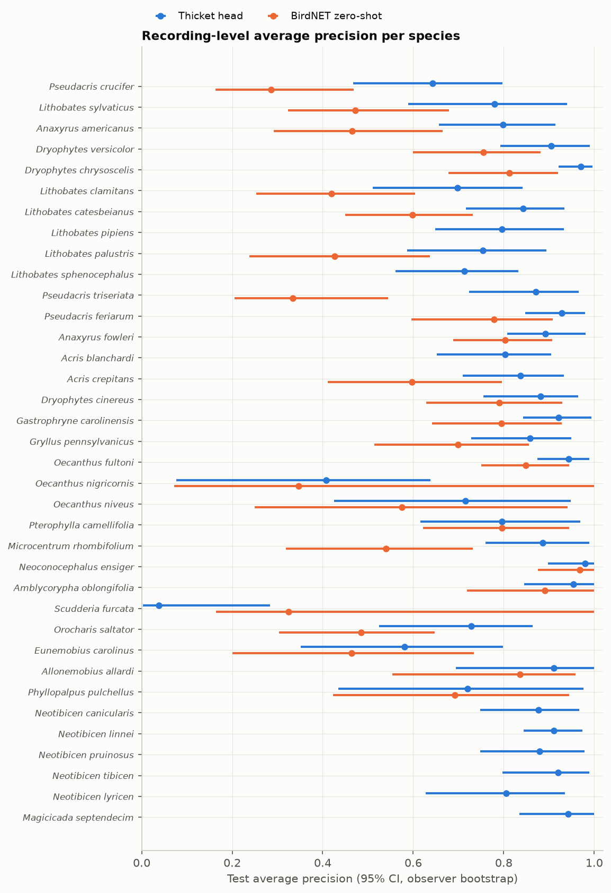
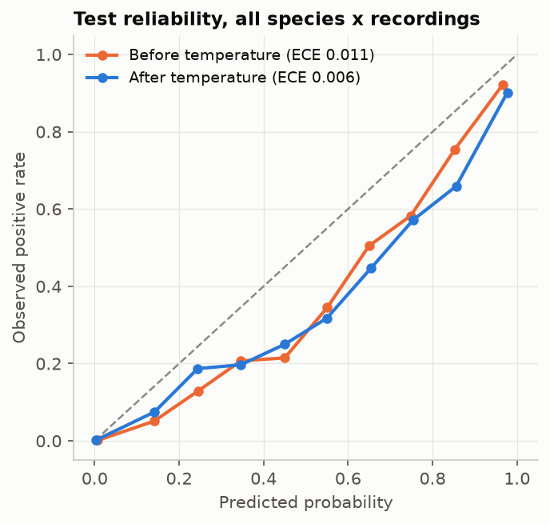

# Frog and insect head v1: evaluation report

Generated by `ml/train/frog_insect.py` on 2026-10-01 from the thicket-inat-v1 feature dataset (manifest sha256 below). All numbers below come from `results.json` in the same folder.

## Pre-metric checks

| Check | Status | Detail |
|---|---|---|
| run parameters | pass | split [0.7, 0.15, 0.15], seed 20260924, rms floor -60.0 dBFS, top-k 3, model mlp, C grid [0.001, 0.003, 0.01, 0.03, 0.1] |
| manifest integrity | warn | dropped 42 recordings whose audio bytes duplicate another recording |
| label-set compatibility | pass | all 37 config targets present |
| model identity | pass | 2 parts, 1024-d embeddings, 140 subset labels match BirdNET v2.4 (verified against local weights sha256 55f3e4055b1a); parts carry no weights hash, so identity rests on the label space |
| manifest integrity | pass | 9060 manifest rows, 9016 usable recordings, 58173 windows; counts match |
| observer-disjoint split | pass | 3998 observers, no observer in two splits |
| label-set compatibility | warn | 1 classes have fewer than 10 training recordings and are not modeled: ['Neoconocephalus robustus'] |

Manifest sha256 `022ea283ac75f9d7d7d57acc8365970ec155752362d9893414c54d598ec2cea2`. RMS floor -60.0 dBFS kept 56903 of 58173 windows (78 recordings kept only their loudest window).

## Data and splits

Splits are grouped by iNaturalist observer (`user_id`) and stratified by label: no observer contributes to two splits. Labels are clip level and weak.

| Class | Train rec. | Val rec. | Test rec. | Test observers |
|---|---|---|---|---|
| Pseudacris crucifer | 154 | 33 | 33 | 25 |
| Lithobates sylvaticus | 154 | 33 | 33 | 24 |
| Anaxyrus americanus | 153 | 33 | 33 | 24 |
| Dryophytes versicolor | 154 | 33 | 33 | 30 |
| Dryophytes chrysoscelis | 152 | 33 | 33 | 28 |
| Lithobates clamitans | 154 | 33 | 33 | 28 |
| Lithobates catesbeianus | 151 | 33 | 33 | 28 |
| Lithobates pipiens | 154 | 33 | 33 | 24 |
| Lithobates palustris | 153 | 32 | 32 | 22 |
| Lithobates sphenocephalus | 154 | 33 | 33 | 23 |
| Pseudacris triseriata | 154 | 33 | 33 | 21 |
| Pseudacris feriarum | 149 | 33 | 33 | 24 |
| Anaxyrus fowleri | 153 | 32 | 33 | 24 |
| Acris blanchardi | 151 | 32 | 33 | 20 |
| Acris crepitans | 154 | 33 | 33 | 26 |
| Dryophytes cinereus | 153 | 33 | 33 | 27 |
| Gastrophryne carolinensis | 152 | 33 | 32 | 24 |
| Gryllus pennsylvanicus | 154 | 33 | 33 | 22 |
| Oecanthus fultoni | 154 | 33 | 33 | 24 |
| Oecanthus nigricornis | 15 | 4 | 4 | 3 |
| Oecanthus niveus | 42 | 9 | 9 | 7 |
| Pterophylla camellifolia | 154 | 33 | 33 | 26 |
| Microcentrum rhombifolium | 154 | 33 | 33 | 22 |
| Neoconocephalus ensiger | 76 | 16 | 15 | 10 |
| Amblycorypha oblongifolia | 68 | 14 | 13 | 9 |
| Scudderia furcata | 11 | 2 | 2 | 2 |
| Orocharis saltator | 154 | 33 | 33 | 21 |
| Eunemobius carolinus | 83 | 17 | 17 | 11 |
| Allonemobius allardi | 65 | 13 | 15 | 10 |
| Phyllopalpus pulchellus | 44 | 9 | 9 | 7 |
| Neotibicen canicularis | 154 | 33 | 33 | 26 |
| Neotibicen linnei | 153 | 33 | 33 | 22 |
| Neotibicen pruinosus | 154 | 33 | 33 | 25 |
| Neotibicen tibicen | 154 | 33 | 33 | 23 |
| Neotibicen lyricen | 153 | 33 | 33 | 18 |
| Magicicada septendecim | 154 | 33 | 33 | 18 |
| [negative] bird | 816 | 174 | 174 |  |
| [negative] other_anura | 275 | 59 | 58 |  |
| [negative] other_orthoptera | 278 | 60 | 60 |  |
| [negative] other_cicadas | 105 | 22 | 23 |  |
| [negative] mammals | 140 | 30 | 30 |  |

Not modeled (too few training recordings): Neoconocephalus robustus.

## Model selection (validation only)

* Stage 1 (all windows, clip labels): C = 0.001, val macro AP by C: 0.001: 0.793, 0.003: 0.791, 0.01: 0.772, 0.03: 0.762, 0.1: 0.755.
* Stage 2 (multiple-instance, top 3 windows per positive recording, 23104 windows): C = 0.003, val macro AP by C: 0.001: 0.778, 0.003: 0.797, 0.01: 0.786, 0.03: 0.778, 0.1: 0.776.
* Chosen on validation: **stage2** (val macro AP stage 1 0.793, stage 2 0.797). Temperature 0.766; per-class thresholds maximize validation F1.

## Test results (stage2, recording level = max over windows)

95% CIs resample observers (cluster bootstrap).

| Species | Test positives | AP | ROC AUC | Precision | Recall | F1 |
|---|---|---|---|---|---|---|
| *Pseudacris crucifer* | 33 | 0.642 (0.467 to 0.797) | 0.972 (0.954 to 0.989) | 0.545 (0.364 to 0.727) | 0.545 (0.360 to 0.735) | 0.545 (0.390 to 0.691) |
| *Lithobates sylvaticus* | 33 | 0.779 (0.589 to 0.940) | 0.983 (0.960 to 0.999) | 0.889 (0.750 to 1.000) | 0.727 (0.531 to 0.926) | 0.800 (0.655 to 0.921) |
| *Anaxyrus americanus* | 33 | 0.798 (0.657 to 0.914) | 0.994 (0.988 to 0.998) | 0.675 (0.521 to 0.822) | 0.818 (0.647 to 0.971) | 0.740 (0.594 to 0.861) |
| *Dryophytes versicolor* | 33 | 0.905 (0.793 to 0.990) | 0.998 (0.996 to 1.000) | 0.935 (0.854 to 1.000) | 0.879 (0.771 to 0.972) | 0.906 (0.839 to 0.969) |
| *Dryophytes chrysoscelis* | 33 | 0.970 (0.921 to 0.996) | 0.999 (0.998 to 1.000) | 0.879 (0.758 to 1.000) | 0.879 (0.750 to 0.975) | 0.879 (0.783 to 0.962) |
| *Lithobates clamitans* | 33 | 0.698 (0.511 to 0.842) | 0.979 (0.961 to 0.990) | 0.600 (0.410 to 0.766) | 0.636 (0.452 to 0.806) | 0.618 (0.467 to 0.753) |
| *Lithobates catesbeianus* | 33 | 0.843 (0.717 to 0.934) | 0.962 (0.915 to 0.995) | 0.828 (0.677 to 0.950) | 0.727 (0.555 to 0.865) | 0.774 (0.619 to 0.882) |
| *Lithobates pipiens* | 33 | 0.797 (0.649 to 0.932) | 0.989 (0.979 to 0.998) | 0.828 (0.652 to 0.968) | 0.727 (0.583 to 0.862) | 0.774 (0.634 to 0.877) |
| *Lithobates palustris* | 32 | 0.754 (0.587 to 0.894) | 0.963 (0.926 to 0.992) | 1.000 (1.000 to 1.000) | 0.562 (0.382 to 0.727) | 0.720 (0.549 to 0.846) |
| *Lithobates sphenocephalus* | 33 | 0.713 (0.561 to 0.832) | 0.966 (0.936 to 0.986) | 0.870 (0.722 to 1.000) | 0.606 (0.474 to 0.750) | 0.714 (0.600 to 0.821) |
| *Pseudacris triseriata* | 33 | 0.871 (0.723 to 0.965) | 0.992 (0.983 to 0.999) | 0.750 (0.553 to 0.892) | 0.818 (0.640 to 0.974) | 0.783 (0.629 to 0.892) |
| *Pseudacris feriarum* | 33 | 0.928 (0.847 to 0.980) | 0.997 (0.994 to 0.999) | 0.674 (0.500 to 0.816) | 0.939 (0.868 to 1.000) | 0.785 (0.667 to 0.877) |
| *Anaxyrus fowleri* | 33 | 0.892 (0.808 to 0.981) | 0.984 (0.957 to 0.999) | 0.931 (0.833 to 1.000) | 0.818 (0.677 to 0.950) | 0.871 (0.779 to 0.951) |
| *Acris blanchardi* | 33 | 0.803 (0.652 to 0.904) | 0.994 (0.990 to 0.997) | 0.667 (0.483 to 0.822) | 0.788 (0.650 to 0.911) | 0.722 (0.585 to 0.826) |
| *Acris crepitans* | 33 | 0.837 (0.710 to 0.933) | 0.976 (0.928 to 0.998) | 0.694 (0.528 to 0.846) | 0.758 (0.594 to 0.900) | 0.725 (0.590 to 0.836) |
| *Dryophytes cinereus* | 33 | 0.882 (0.755 to 0.965) | 0.996 (0.993 to 0.999) | 0.800 (0.650 to 0.920) | 0.848 (0.697 to 0.970) | 0.824 (0.704 to 0.911) |
| *Gastrophryne carolinensis* | 32 | 0.921 (0.842 to 0.993) | 0.995 (0.986 to 1.000) | 0.875 (0.774 to 0.971) | 0.875 (0.759 to 0.968) | 0.875 (0.783 to 0.955) |
| *Gryllus pennsylvanicus* | 33 | 0.858 (0.728 to 0.949) | 0.996 (0.993 to 0.999) | 0.682 (0.513 to 0.816) | 0.909 (0.800 to 1.000) | 0.779 (0.667 to 0.867) |
| *Oecanthus fultoni* | 33 | 0.943 (0.875 to 0.989) | 0.997 (0.991 to 1.000) | 0.933 (0.857 to 1.000) | 0.848 (0.679 to 0.971) | 0.889 (0.789 to 0.963) |
| *Oecanthus nigricornis* | 4 | 0.407 (0.077 to 0.638) | 0.950 (0.896 to 0.998) | 1.000 (1.000 to 1.000) | 0.250 (0.000 to 0.500) | 0.400 (0.000 to 0.667) |
| *Oecanthus niveus* | 9 | 0.715 (0.425 to 0.948) | 0.998 (0.994 to 1.000) | 0.500 (0.200 to 0.818) | 0.778 (0.500 to 1.000) | 0.609 (0.308 to 0.833) |
| *Pterophylla camellifolia* | 33 | 0.796 (0.616 to 0.969) | 0.995 (0.990 to 0.999) | 0.692 (0.514 to 0.897) | 0.818 (0.690 to 0.936) | 0.750 (0.604 to 0.885) |
| *Microcentrum rhombifolium* | 33 | 0.886 (0.760 to 0.989) | 0.990 (0.968 to 1.000) | 0.900 (0.806 to 1.000) | 0.818 (0.649 to 1.000) | 0.857 (0.750 to 0.957) |
| *Neoconocephalus ensiger* | 15 | 0.980 (0.897 to 1.000) | 1.000 (0.999 to 1.000) | 0.933 (0.733 to 1.000) | 0.933 (0.750 to 1.000) | 0.933 (0.782 to 1.000) |
| *Amblycorypha oblongifolia* | 13 | 0.954 (0.845 to 1.000) | 0.999 (0.997 to 1.000) | 1.000 (1.000 to 1.000) | 0.923 (0.750 to 1.000) | 0.960 (0.857 to 1.000) |
| *Scudderia furcata* | 2 | 0.039 (0.002 to 0.283) | 0.863 (0.702 to 0.997) | 0.000 (0.000 to 0.000) | 0.000 (0.000 to 0.000) | 0.000 (0.000 to 0.000) |
| *Orocharis saltator* | 33 | 0.728 (0.525 to 0.863) | 0.991 (0.986 to 0.996) | 0.632 (0.462 to 0.769) | 0.727 (0.533 to 0.878) | 0.676 (0.533 to 0.776) |
| *Eunemobius carolinus* | 17 | 0.581 (0.352 to 0.799) | 0.985 (0.969 to 0.997) | 0.526 (0.235 to 0.750) | 0.588 (0.286 to 0.889) | 0.556 (0.267 to 0.750) |
| *Allonemobius allardi* | 15 | 0.910 (0.695 to 1.000) | 0.998 (0.996 to 1.000) | 0.765 (0.429 to 0.958) | 0.867 (0.615 to 1.000) | 0.812 (0.545 to 0.941) |
| *Phyllopalpus pulchellus* | 9 | 0.720 (0.435 to 0.976) | 0.993 (0.986 to 1.000) | 0.600 (0.333 to 0.875) | 0.667 (0.400 to 1.000) | 0.632 (0.374 to 0.842) |
| *Neotibicen canicularis* | 33 | 0.877 (0.748 to 0.966) | 0.996 (0.992 to 0.999) | 0.839 (0.677 to 0.964) | 0.788 (0.625 to 0.917) | 0.812 (0.667 to 0.911) |
| *Neotibicen linnei* | 33 | 0.910 (0.844 to 0.974) | 0.979 (0.943 to 0.999) | 0.829 (0.700 to 0.943) | 0.879 (0.789 to 0.968) | 0.853 (0.762 to 0.929) |
| *Neotibicen pruinosus* | 33 | 0.879 (0.748 to 0.978) | 0.995 (0.989 to 0.999) | 0.931 (0.812 to 1.000) | 0.818 (0.650 to 0.947) | 0.871 (0.757 to 0.955) |
| *Neotibicen tibicen* | 33 | 0.920 (0.797 to 0.989) | 0.993 (0.978 to 1.000) | 0.960 (0.857 to 1.000) | 0.727 (0.559 to 0.882) | 0.828 (0.688 to 0.923) |
| *Neotibicen lyricen* | 33 | 0.805 (0.628 to 0.936) | 0.993 (0.986 to 0.999) | 0.703 (0.516 to 0.846) | 0.788 (0.571 to 0.969) | 0.743 (0.571 to 0.857) |
| *Magicicada septendecim* | 33 | 0.942 (0.834 to 1.000) | 0.990 (0.965 to 1.000) | 0.968 (0.882 to 1.000) | 0.909 (0.778 to 1.000) | 0.937 (0.852 to 0.989) |

* Macro: precision 0.773 (0.745 to 0.812), recall 0.750 (0.720 to 0.792), f1 0.749 (0.716 to 0.782), ap 0.802 (0.781 to 0.846), auc 0.984 (0.979 to 0.991).
* Micro: precision 0.780 (0.755 to 0.806), recall 0.782 (0.753 to 0.812), f1 0.781 (0.757 to 0.803), ap 0.836 (0.807 to 0.865).
* The other stage (stage1) on test, for reference: macro AP 0.795 (0.772 to 0.842).
* Calibration on test: ECE 0.011 before and 0.006 after temperature scaling.

Open-set false positive rate (share of negative test recordings where any species fires):

* bird: 0.063 (0.036 to 0.110; 11/174)
* other_anura: 0.259 (0.163 to 0.384; 15/58)
* other_orthoptera: 0.283 (0.185 to 0.408; 17/60)
* other_cicadas: 0.304 (0.156 to 0.509; 7/23)
* mammals: 0.100 (0.035 to 0.256; 3/30)
* all_negatives: 0.154 (0.119 to 0.195; 53/345)

## BirdNET zero-shot on the classes it covers

BirdNET covers 27 of the modeled classes. BirdNET score = max over the same windows of its label probability; its threshold is chosen on validation F1, like the head's.

| Species | BirdNET AP | Head AP | BirdNET F1 (val thr) | BirdNET F1 at 0.60 | Head F1 |
|---|---|---|---|---|---|
| *Pseudacris crucifer* | 0.285 (0.163 to 0.468) | 0.642 (0.476 to 0.803) | 0.390 (0.240 to 0.535) | 0.140 (0.000 to 0.279) | 0.545 (0.381 to 0.684) |
| *Lithobates sylvaticus* | 0.472 (0.323 to 0.679) | 0.779 (0.590 to 0.942) | 0.481 (0.300 to 0.645) | 0.409 (0.235 to 0.579) | 0.800 (0.650 to 0.923) |
| *Anaxyrus americanus* | 0.465 (0.292 to 0.665) | 0.798 (0.649 to 0.921) | 0.515 (0.353 to 0.667) | 0.158 (0.000 to 0.341) | 0.740 (0.588 to 0.864) |
| *Dryophytes versicolor* | 0.755 (0.600 to 0.881) | 0.905 (0.799 to 0.990) | 0.667 (0.525 to 0.795) | 0.630 (0.450 to 0.769) | 0.906 (0.826 to 0.973) |
| *Dryophytes chrysoscelis* | 0.813 (0.678 to 0.919) | 0.970 (0.930 to 0.996) | 0.781 (0.656 to 0.886) | 0.571 (0.390 to 0.727) | 0.879 (0.772 to 0.959) |
| *Lithobates clamitans* | 0.420 (0.254 to 0.604) | 0.698 (0.508 to 0.847) | 0.476 (0.291 to 0.627) | 0.279 (0.103 to 0.453) | 0.618 (0.448 to 0.744) |
| *Lithobates catesbeianus* | 0.598 (0.450 to 0.731) | 0.843 (0.701 to 0.940) | 0.554 (0.400 to 0.674) | 0.489 (0.324 to 0.633) | 0.774 (0.632 to 0.880) |
| *Lithobates palustris* | 0.426 (0.238 to 0.637) | 0.754 (0.594 to 0.897) | 0.383 (0.167 to 0.561) | 0.400 (0.182 to 0.566) | 0.720 (0.564 to 0.852) |
| *Pseudacris triseriata* | 0.334 (0.205 to 0.545) | 0.871 (0.714 to 0.965) | 0.364 (0.237 to 0.481) | 0.182 (0.045 to 0.351) | 0.783 (0.625 to 0.897) |
| *Pseudacris feriarum* | 0.779 (0.596 to 0.908) | 0.928 (0.848 to 0.977) | 0.742 (0.560 to 0.857) | 0.419 (0.210 to 0.627) | 0.785 (0.656 to 0.878) |
| *Anaxyrus fowleri* | 0.804 (0.688 to 0.908) | 0.892 (0.813 to 0.971) | 0.772 (0.667 to 0.864) | 0.533 (0.346 to 0.700) | 0.871 (0.780 to 0.949) |
| *Acris crepitans* | 0.597 (0.411 to 0.796) | 0.837 (0.715 to 0.929) | 0.582 (0.400 to 0.727) | 0.490 (0.308 to 0.642) | 0.725 (0.588 to 0.828) |
| *Dryophytes cinereus* | 0.790 (0.629 to 0.929) | 0.882 (0.749 to 0.973) | 0.737 (0.571 to 0.871) | 0.667 (0.510 to 0.806) | 0.824 (0.712 to 0.913) |
| *Gastrophryne carolinensis* | 0.794 (0.641 to 0.928) | 0.921 (0.839 to 0.994) | 0.716 (0.580 to 0.848) | 0.716 (0.580 to 0.848) | 0.875 (0.792 to 0.951) |
| *Gryllus pennsylvanicus* | 0.699 (0.514 to 0.856) | 0.858 (0.735 to 0.945) | 0.627 (0.428 to 0.815) | 0.216 (0.000 to 0.421) | 0.779 (0.667 to 0.868) |
| *Oecanthus fultoni* | 0.848 (0.750 to 0.945) | 0.943 (0.879 to 0.991) | 0.857 (0.745 to 0.947) | 0.627 (0.461 to 0.764) | 0.889 (0.780 to 0.966) |
| *Oecanthus nigricornis* | 0.346 (0.071 to 1.000) | 0.407 (0.083 to 0.649) | 0.400 (0.000 to 0.667) | 0.571 (0.000 to 1.000) | 0.400 (0.000 to 0.667) |
| *Oecanthus niveus* | 0.574 (0.250 to 0.941) | 0.715 (0.424 to 0.957) | 0.571 (0.200 to 0.857) | 0.000 (0.000 to 0.000) | 0.609 (0.250 to 0.824) |
| *Pterophylla camellifolia* | 0.796 (0.621 to 0.945) | 0.796 (0.636 to 0.970) | 0.765 (0.627 to 0.893) | 0.549 (0.333 to 0.731) | 0.750 (0.607 to 0.882) |
| *Microcentrum rhombifolium* | 0.539 (0.319 to 0.731) | 0.886 (0.754 to 0.988) | 0.517 (0.333 to 0.667) | 0.293 (0.121 to 0.455) | 0.857 (0.754 to 0.954) |
| *Neoconocephalus ensiger* | 0.968 (0.875 to 1.000) | 0.980 (0.896 to 1.000) | 0.875 (0.625 to 1.000) | 0.897 (0.667 to 1.000) | 0.933 (0.769 to 1.000) |
| *Amblycorypha oblongifolia* | 0.890 (0.719 to 1.000) | 0.954 (0.861 to 1.000) | 0.783 (0.667 to 0.941) | 0.556 (0.286 to 0.857) | 0.960 (0.857 to 1.000) |
| *Scudderia furcata* | 0.325 (0.164 to 1.000) | 0.039 (0.002 to 0.286) | 0.000 (0.000 to 0.000) | 0.000 (0.000 to 0.000) | 0.000 (0.000 to 0.000) |
| *Orocharis saltator* | 0.484 (0.304 to 0.648) | 0.728 (0.534 to 0.856) | 0.475 (0.303 to 0.625) | 0.341 (0.121 to 0.531) | 0.676 (0.526 to 0.778) |
| *Eunemobius carolinus* | 0.464 (0.201 to 0.734) | 0.581 (0.339 to 0.789) | 0.483 (0.190 to 0.750) | 0.286 (0.000 to 0.616) | 0.556 (0.266 to 0.750) |
| *Allonemobius allardi* | 0.836 (0.554 to 0.958) | 0.910 (0.693 to 1.000) | 0.636 (0.308 to 0.800) | 0.500 (0.143 to 0.786) | 0.812 (0.545 to 0.946) |
| *Phyllopalpus pulchellus* | 0.692 (0.423 to 0.945) | 0.720 (0.466 to 0.986) | 0.500 (0.000 to 0.833) | 0.462 (0.000 to 0.751) | 0.632 (0.400 to 0.833) |

Macro AP difference (head minus BirdNET) on covered classes: 0.165 (0.121 to 0.198).

## Perch comparison

No `perch_part_*.npz` files in the dataset; skipped.

## Release readiness

Bar per class: at least 10 test recordings from at least 3 distinct test observers. 32 of 36 modeled classes meet it. Classes below the bar must stay disabled (or be shown as unvalidated) whatever their point estimates say.

Below the bar: *Oecanthus nigricornis* (4 rec., 3 obs.), *Oecanthus niveus* (9 rec., 7 obs.), *Scudderia furcata* (2 rec., 2 obs.), *Phyllopalpus pulchellus* (9 rec., 7 obs.).

Exported head: `frog_insect_head_v1.npz (MLP variant, not shipped)` (sha256 `f7f56e66f43b8791...`), arrays W1, W2, b1, b2, common_names, created, embedding_mean, embedding_std, format, labels, license, manifest_sha256, pooling, stage, taxa, temperature, thresholds. Window score = sigmoid(logit / temperature); the recording score is the max over windows, so the per-class thresholds also work as window-level floors.

## Limits

* iNaturalist recordings are opportunistic, mostly close and loud, and labels are clip level. Field passive recordings are harder; these numbers are not field accuracy.
* The observer split prevents one person's recordings from appearing in both train and test, but sites and regions may still overlap.
* Window-level outputs exist (the head scores every 3 s window), but window-level accuracy cannot be measured without window labels.
