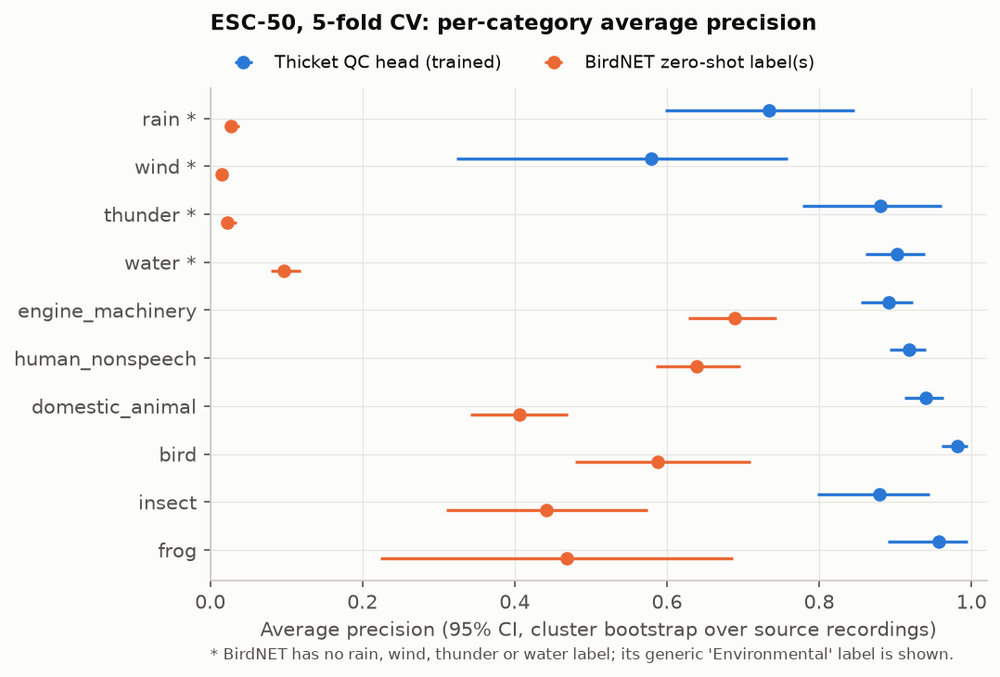
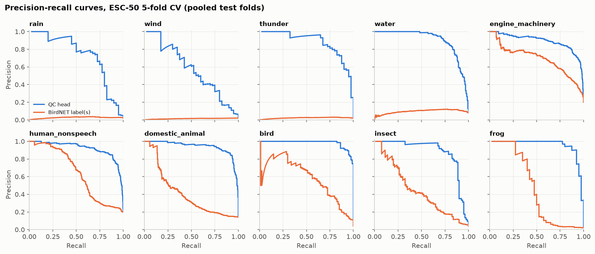
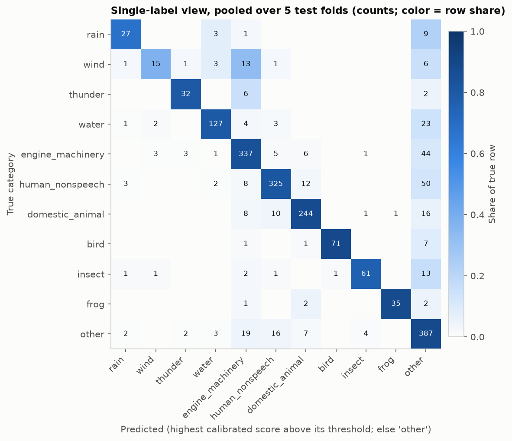
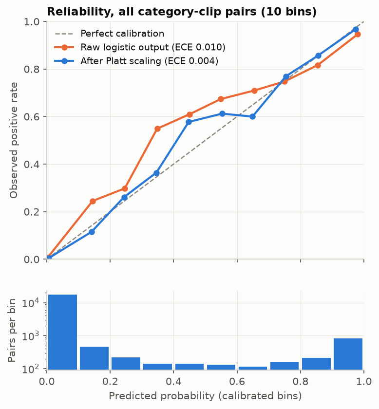
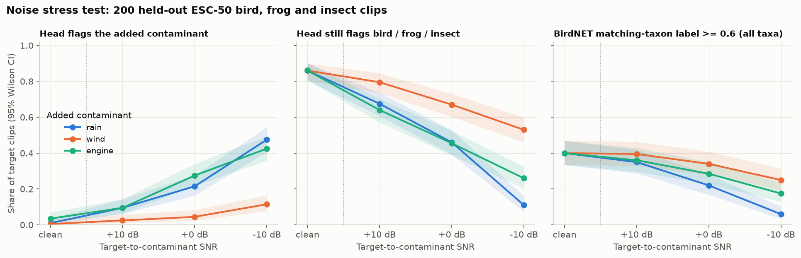

# Soundscape QC head v1 on ESC-50: evaluation report

Generated on 2026-09-24 by `ml/train/esc50_qc.py` (report text by `ml/train/esc50_qc_report.py`). Every number comes from `ml/reports/qc_esc50_v1_results.json`, which also stores the settings used. Model card: `docs/model-cards/qc-soundscape-v1.md`.

## Summary

* Reference probe (Experiment A): a linear classifier on frozen BirdNET embeddings reaches 84.4% accuracy on the 50 ESC-50 classes (standard deviation 1.4 points over the 5 official folds).
* QC head (Experiment B), pooled over the 5 test folds: macro average precision 0.866 (0.835 to 0.896), macro F1 0.800 (0.768 to 0.827), micro F1 0.837 (0.819 to 0.852) at thresholds chosen on training folds.
* Against BirdNET's own labels used zero-shot, the trained head has higher average precision in 10 of 10 categories (95% CI of the difference above zero: rain, wind, thunder, water, engine_machinery, human_nonspeech, domestic_animal, bird, insect, frog); it is not clearly worse in any category. Macro AP: head 0.866 vs BirdNET labels 0.339.
* Calibration: expected calibration error 0.010 before and 0.004 after Platt scaling fitted on training folds.
* Long recordings (synthetic, from test-fold clips; backend warning rule): scoring 6 s segments and requiring a category in at least a quarter of them (the exported default) catches contamination covering half or all of a 30 s recording 80% and 93% of the time, with false warnings on 5% (30 s) and 1% (60 s) of clean bird, insect and frog recordings. It misses short bursts (1 of 6 clips: 5%). A plain max over segments would catch 73% of bursts but falsely warn on 48% (30 s) and 80% (60 s) of clean recordings.
* Noise stress test (200 held-out bird, frog and insect clips): the head flags the added contaminant at +10 / 0 / -10 dB SNR in rain 10% / 22% / 48%; wind 2% / 4% / 12%; engine 10% / 28% / 42% of mixtures.
* These are ESC-50 numbers: short, curated, mostly close-range clips with one label each. They are not field accuracy. The head is a QC aid, not a validated detector.

## Setup

* **Data.** ESC-50 (commit `33c8ce9eb2cf`), 2000 clips of 5 s, 50 classes x 40, from 1524 Freesound source recordings. License CC BY-NC 3.0. We use the 5 official folds, which keep clips cut from the same source recording in one fold.
* **Features.** Audio decoded with `thicket.services.audio_io.decode` to 48 kHz mono, cut by `frame_windows` into 3 s windows with a 1 s hop (6000 windows, 3 per clip), and run through `BirdNETRuntime` (BirdNET GLOBAL 6K v2.4 FP32, sha256 `55f3e4055b1a13bf...`). A clip feature is the mean and the max of its window embeddings (2 x 1024 = 2048 values).
* **Model.** Standardization, then one logistic regression per category (multi-label, L2 penalty, full-batch L-BFGS). Nothing else is learned.
* **Protocol.** Train on 4 folds, test on the fifth, rotate. Inside the 4 training folds, a leave-one-fold-out loop picks the regularization strength C (grid [0.001, 0.003, 0.01, 0.03, 0.1, 0.3]) by macro average precision, then fits Platt scaling and the per-category decision thresholds on the out-of-fold training predictions. The test fold is used once. Test predictions from the 5 folds are pooled (each clip is tested exactly once).
* **Uncertainty.** 95% intervals are percentile intervals from a cluster bootstrap over source recordings (1000 resamples), so takes from the same Freesound recording move together. Rates in the stress tests use Wilson intervals.
* **Possible overlap.** BirdNET is not documented as trained on ESC-50, but its training data (mainly xeno-canto and the Macaulay Library, plus other collections for its non-bird and noise classes) may share source recordings with ESC-50, which was cut from Freesound recordings. We could not check this, so all numbers may be somewhat optimistic, most of all the BirdNET-label baseline for sources BirdNET has labels for (dog, engine, siren, human).

## Category mapping

| Category | Kind | ESC-50 classes | Clips |
|---|---|---|---|
| `rain` | geophony | rain | 40 |
| `wind` | geophony | wind | 40 |
| `thunder` | geophony | thunderstorm | 40 |
| `water` | geophony | sea_waves, water_drops, pouring_water, toilet_flush | 160 |
| `engine_machinery` | anthropophony | engine, train, airplane, helicopter, chainsaw, hand_saw, vacuum_cleaner, washing_machine, siren, car_horn | 400 |
| `human_nonspeech` | anthropophony | crying_baby, sneezing, clapping, breathing, coughing, footsteps, laughing, brushing_teeth, snoring, drinking_sipping | 400 |
| `domestic_animal` | biophony_non_target | dog, cat, hen, rooster, cow, pig, sheep | 280 |
| `bird` | biophony | chirping_birds, crow | 80 |
| `insect` | biophony | insects, crickets | 80 |
| `frog` | biophony | frog | 40 |
| negatives (all zeros) | n/a | crackling_fire, church_bells, fireworks, door_wood_knock, door_wood_creaks, mouse_click, keyboard_typing, can_opening, clock_alarm, clock_tick, glass_breaking | 440 |

Decisions:

* `crackling_fire` is a negative, not its own category. Fire is rare in passive monitoring, one 40-clip class would only teach a campfire detector, and its crackle can resemble rain on hard surfaces, so it is more useful as a hard negative for `rain`.
* `water` includes `toilet_flush` and `pouring_water` next to `sea_waves` and `water_drops`: they are indoor recordings, but acoustically they are running or dripping water, which is what streams, culverts and drips sound like in the field.
* `engine_machinery` covers motors and vehicles (`engine`, `train`, `airplane`, `helicopter`), powered and hand tools (`chainsaw`, `hand_saw`), motor appliances as stand-ins for pumps and generators (`vacuum_cleaner`, `washing_machine`), and traffic signals (`siren`, `car_horn`). `church_bells` and `fireworks` are human-made but not machinery; they stay negatives.
* `human_nonspeech` is exactly ESC-50's 'human, non-speech sounds' group (crying baby, sneezing, clapping, breathing, coughing, footsteps, laughing, brushing teeth, snoring, drinking). ESC-50 has no speech; speech is handled in the backend by BirdNET's `Human vocal` label.
* `hen` and `rooster` are birds, but they count as `domestic_animal` because in the product `bird` means wild bird sound. This penalizes the BirdNET baseline for `bird`, whose bird labels also respond to chickens (numbers below).
* Indoor object sounds (door knock, door creaks, mouse click, keyboard typing, can opening, clock alarm, clock tick, glass breaking) are negatives: they are not expected in field audio and there is no QC action for them.

## Experiment A: 50-class linear probe (reference)

Softmax regression on the same 2048-d clip features, C chosen on inner folds (grid [0.001, 0.01, 0.1, 1.0]).

| Test fold | Accuracy | C chosen on training folds |
|---|---|---|
| 1 | 83.00% | 0.1 |
| 2 | 86.50% | 0.01 |
| 3 | 84.25% | 1.0 |
| 4 | 85.00% | 0.01 |
| 5 | 83.25% | 0.01 |
| **mean (std over folds)** | **84.40% (1.42)** | |

Published ESC-50 accuracies for context, as listed in the ESC-50 repository README (5-fold CV; most are fully trained or fine-tuned networks, not linear probes on frozen features, so this is a rough comparison):

| Method | Accuracy | Source |
|---|---|---|
| Human listeners (crowdsourced) | 81.30% | piczak2015a |
| MFCC + ZCR, random forest baseline | 44.30% | piczak2015a |
| CNN baseline on mel spectrograms | 64.50% | piczak2015b |
| CNN pretrained on AudioSet | 83.50% | kumar2017 |
| AST, transformer pretrained on AudioSet | 95.70% | gong2021 |
| BEATs, transformer with acoustic tokenizers | 98.10% | chen2022 |
| BirdNET v2.4 embeddings + linear probe (this work) | 84.40% | this report |

Hardest classes: helicopter 42%, washing_machine 57%, wind 60%, airplane 68%, breathing 70%, laughing 70%. Easiest: chirping_birds 98%, pouring_water 98%, clapping 98%, glass_breaking 98%, dog 100%, hen 100%.

Most frequent confusions (true -> predicted, clips): coughing -> sneezing (8); helicopter -> airplane (6); fireworks -> clapping (6); cat -> crying_baby (4); wind -> helicopter (4); mouse_click -> water_drops (4).

## Experiment B: Thicket QC categories

### Head at F1-optimal thresholds (chosen on training folds)

| Category | Positives | Flagged | Precision | Recall | F1 | Average precision | ROC AUC |
|---|---|---|---|---|---|---|---|
| `rain` | 40 | 40 | 0.700 (0.555 to 0.837) | 0.700 (0.552 to 0.826) | 0.700 (0.568 to 0.804) | 0.734 (0.597 to 0.846) | 0.971 (0.944 to 0.992) |
| `wind` | 40 | 34 | 0.529 (0.278 to 0.742) | 0.450 (0.222 to 0.667) | 0.486 (0.264 to 0.667) | 0.580 (0.324 to 0.758) | 0.965 (0.932 to 0.987) |
| `thunder` | 40 | 41 | 0.805 (0.630 to 0.939) | 0.825 (0.682 to 0.951) | 0.815 (0.675 to 0.917) | 0.881 (0.778 to 0.961) | 0.996 (0.992 to 0.999) |
| `water` | 160 | 158 | 0.829 (0.760 to 0.892) | 0.819 (0.746 to 0.878) | 0.824 (0.768 to 0.870) | 0.903 (0.861 to 0.939) | 0.981 (0.970 to 0.990) |
| `engine_machinery` | 400 | 425 | 0.805 (0.757 to 0.852) | 0.855 (0.818 to 0.891) | 0.829 (0.793 to 0.861) | 0.891 (0.854 to 0.923) | 0.970 (0.961 to 0.978) |
| `human_nonspeech` | 400 | 389 | 0.861 (0.823 to 0.896) | 0.838 (0.799 to 0.874) | 0.849 (0.817 to 0.876) | 0.918 (0.893 to 0.941) | 0.975 (0.967 to 0.982) |
| `domestic_animal` | 280 | 301 | 0.850 (0.801 to 0.897) | 0.914 (0.879 to 0.946) | 0.881 (0.847 to 0.910) | 0.940 (0.912 to 0.963) | 0.989 (0.984 to 0.993) |
| `bird` | 80 | 75 | 0.947 (0.879 to 1.000) | 0.887 (0.800 to 0.958) | 0.916 (0.859 to 0.964) | 0.982 (0.960 to 0.995) | 0.999 (0.998 to 1.000) |
| `insect` | 80 | 80 | 0.812 (0.714 to 0.909) | 0.812 (0.701 to 0.903) | 0.812 (0.727 to 0.884) | 0.879 (0.797 to 0.945) | 0.980 (0.959 to 0.996) |
| `frog` | 40 | 41 | 0.878 (0.725 to 0.979) | 0.900 (0.771 to 1.000) | 0.889 (0.789 to 0.961) | 0.957 (0.890 to 0.995) | 0.998 (0.995 to 1.000) |
| **macro** | | | 0.802 (0.764 to 0.834) | 0.800 (0.767 to 0.831) | 0.800 (0.768 to 0.827) | 0.866 (0.835 to 0.896) | 0.982 (0.977 to 0.987) |
| **micro** | | | 0.830 (0.811 to 0.850) | 0.843 (0.825 to 0.861) | 0.837 (0.819 to 0.852) | 0.908 (0.893 to 0.921) | n/a |

Macro AP per test fold: mean 0.873, standard deviation 0.035 (fold 1: 0.856, fold 2: 0.915, fold 3: 0.826, fold 4: 0.895, fold 5: 0.871). C chosen per fold: 1: 0.3, 2: 0.03, 3: 0.1, 4: 0.03, 5: 0.03.





### High-precision operating point

Thresholds chosen on training folds as the lowest score with precision >= 0.90 (out-of-fold). Test results:

| Category | Precision | Recall | F1 |
|---|---|---|---|
| `rain` | 0.750 (0.467 to 1.000) | 0.225 (0.095 to 0.350) | 0.346 (0.170 to 0.500) |
| `wind` | 0.818 (0.444 to 1.000) | 0.225 (0.040 to 0.417) | 0.353 (0.095 to 0.571) |
| `thunder` | 0.913 (0.782 to 1.000) | 0.525 (0.323 to 0.756) | 0.667 (0.462 to 0.824) |
| `water` | 0.858 (0.796 to 0.918) | 0.756 (0.675 to 0.824) | 0.804 (0.747 to 0.856) |
| `engine_machinery` | 0.889 (0.840 to 0.932) | 0.642 (0.597 to 0.687) | 0.746 (0.706 to 0.783) |
| `human_nonspeech` | 0.898 (0.860 to 0.930) | 0.730 (0.682 to 0.776) | 0.806 (0.770 to 0.839) |
| `domestic_animal` | 0.893 (0.848 to 0.934) | 0.832 (0.785 to 0.877) | 0.861 (0.825 to 0.894) |
| `bird` | 0.884 (0.791 to 0.964) | 0.950 (0.893 to 0.990) | 0.916 (0.856 to 0.966) |
| `insect` | 0.909 (0.838 to 0.969) | 0.750 (0.635 to 0.851) | 0.822 (0.732 to 0.888) |
| `frog` | 0.837 (0.675 to 0.947) | 0.900 (0.784 to 0.980) | 0.867 (0.747 to 0.940) |
| **macro** | 0.865 (0.809 to 0.905) | 0.654 (0.620 to 0.689) | 0.719 (0.677 to 0.755) |

### Compared with BirdNET's own labels (zero-shot)

BirdNET has labels for some of these sources. Its clip score is the max over windows of the label probability. Its decision threshold was chosen on the training folds with the same F1 rule. BirdNET has no rain, wind, thunder or water label; for those four rows we show its generic `Environmental` label, which is the closest thing it has.

| Category | BirdNET score used | BirdNET AP | Head AP | AP difference (head minus BirdNET) | BirdNET F1 | Head F1 |
|---|---|---|---|---|---|---|
| `rain` | `Environmental` | 0.027 (0.019 to 0.038) | 0.734 (0.597 to 0.846) | 0.707 (0.564 to 0.828) | 0.000 (0.000 to 0.000) | 0.700 (0.568 to 0.804) |
| `wind` | `Environmental` | 0.015 (0.009 to 0.022) | 0.580 (0.324 to 0.758) | 0.565 (0.319 to 0.750) | 0.000 (0.000 to 0.000) | 0.486 (0.264 to 0.667) |
| `thunder` | `Environmental` | 0.023 (0.014 to 0.035) | 0.881 (0.778 to 0.961) | 0.858 (0.753 to 0.934) | 0.000 (0.000 to 0.000) | 0.815 (0.675 to 0.917) |
| `water` | `Environmental` | 0.097 (0.080 to 0.119) | 0.903 (0.861 to 0.939) | 0.806 (0.764 to 0.843) | 0.000 (0.000 to 0.000) | 0.824 (0.768 to 0.870) |
| `engine_machinery` | `Engine` or `Siren` | 0.689 (0.628 to 0.744) | 0.891 (0.854 to 0.923) | 0.202 (0.149 to 0.252) | 0.652 (0.603 to 0.697) | 0.829 (0.793 to 0.861) |
| `human_nonspeech` | `Human non-vocal` or `Human vocal` or `Human whistle` | 0.639 (0.585 to 0.696) | 0.918 (0.893 to 0.941) | 0.279 (0.230 to 0.330) | 0.587 (0.531 to 0.640) | 0.849 (0.817 to 0.876) |
| `domestic_animal` | `Dog` | 0.407 (0.342 to 0.469) | 0.940 (0.912 to 0.963) | 0.533 (0.464 to 0.597) | 0.322 (0.255 to 0.387) | 0.881 (0.847 to 0.910) |
| `bird` | max over all bird labels | 0.587 (0.479 to 0.710) | 0.982 (0.960 to 0.995) | 0.395 (0.279 to 0.503) | 0.579 (0.477 to 0.667) | 0.916 (0.859 to 0.964) |
| `insect` | max over all insect labels | 0.442 (0.311 to 0.574) | 0.879 (0.797 to 0.945) | 0.438 (0.319 to 0.568) | 0.394 (0.259 to 0.512) | 0.812 (0.727 to 0.884) |
| `frog` | max over all amphibian labels | 0.469 (0.223 to 0.687) | 0.957 (0.890 to 0.995) | 0.489 (0.272 to 0.729) | 0.469 (0.208 to 0.653) | 0.889 (0.789 to 0.961) |
| **macro** | | 0.339 (0.309 to 0.370) | 0.866 (0.835 to 0.896) | | 0.300 (0.267 to 0.327) | 0.800 (0.768 to 0.827) |

On the 80 hen and rooster clips (our `domestic_animal`), BirdNET's highest bird label reaches 0.5 on 24% (16 to 34%; 19/80) and 0.1 on 75% (65 to 83%; 60/80); these count as false positives for the BirdNET `bird` baseline under our mapping.

### Single-label view

Each clip gets the category with the highest calibrated score among those above their threshold, or `other` when none is. Accuracy of this view: 83.0% (11 labels including `other`).



ESC-50 classes that most often raise a flag for a category they do not belong to (out of 40 clips each): wind 23 (engine_machinery 18, water 4, rain 1); thunderstorm 15 (engine_machinery 12, wind 3, insect 1); pig 11 (human_nonspeech 6, engine_machinery 3, frog 2); sea_waves 11 (wind 6, engine_machinery 3, rain 2); church_bells 10 (engine_machinery 7, domestic_animal 2, insect 1); door_wood_creaks 10 (human_nonspeech 4, engine_machinery 3, domestic_animal 3); frog 10 (human_nonspeech 4, domestic_animal 3, bird 2); rain 10 (water 9, wind 1, engine_machinery 1). Clips from the 11 negative classes raise at least one flag 12.0% of the time.

### Calibration

Expected calibration error over all 20,000 category-clip pairs, 10 equal-width bins: 0.010 for the raw logistic outputs and 0.004 after Platt scaling. Most pairs are easy negatives near 0, which makes this ECE look small; the per-category values below are more telling.

| Category | ECE raw | ECE after Platt |
|---|---|---|
| `rain` | 0.005 | 0.005 |
| `wind` | 0.011 | 0.005 |
| `thunder` | 0.006 | 0.003 |
| `water` | 0.011 | 0.003 |
| `engine_machinery` | 0.033 | 0.019 |
| `human_nonspeech` | 0.021 | 0.020 |
| `domestic_animal` | 0.014 | 0.009 |
| `bird` | 0.007 | 0.004 |
| `insect` | 0.012 | 0.007 |
| `frog` | 0.008 | 0.003 |



### Fewer windows

The head was trained on 3 overlapping windows per clip. Scoring only the first 3 s window of each test clip (mean = max = that window): macro AP 0.854 (0.821 to 0.884) and macro F1 0.783 (0.751 to 0.811), vs 0.866 (0.835 to 0.896) and 0.800 (0.768 to 0.827) with all 3 windows.

## Long recordings: pooling check

Field recordings are longer than 5 s, so the head must turn many window embeddings into one recording score. We built synthetic recordings from test-fold window embeddings (no new audio): each clip contributes 2 windows (at 0 s and 2 s, close to the product's 3 s hop). A contaminated recording has 6 clips (about 30 s) of which 1, 3 or all 6 come from one contamination category; the rest are background clips. Clean recordings have 6 or 12 background clips (about 30 s or 60 s). 30 contaminated recordings per category, coverage and fold (150 per cell) and 300 clean recordings per length. Every clip is scored by the fold model that did not train on it. The windows come from separate clips, not one continuous recording, so this is an approximation.

Pooling modes: `whole` pools all windows into one feature; the others score 2-window segments (about 6 s) and take, per category, the k-th highest segment probability: `segment_max` k = 1; `segment_top25` k = ceil(0.25 x segments); `segment_top50` k = ceil(0.5 x segments).

Background: bird, insect and frog clips only. Decision rule: the backend's (p > max(0.5, threshold)). Detection = share of contaminated recordings flagged with the right category (mean over the 7 contamination categories); false warning = share of clean recordings with any contamination flag.

| Pooling | Detected, 1 of 6 clips | Detected, 3 of 6 | Detected, 6 of 6 | False warning, 30 s | False warning, 60 s |
|---|---|---|---|---|---|
| `whole` | 3% | 16% | 82% | 9% | 17% |
| `segment_max` | 73% | 94% | 96% | 48% | 80% |
| `segment_top25` | 5% | 80% | 93% | 5% | 1% |
| `segment_top50` | 0% | 44% | 89% | 0% | 0% |

Background: bird, insect, frog and ESC-50 negative classes. Decision rule: the backend's (p > max(0.5, threshold)). Detection = share of contaminated recordings flagged with the right category (mean over the 7 contamination categories); false warning = share of clean recordings with any contamination flag.

| Pooling | Detected, 1 of 6 clips | Detected, 3 of 6 | Detected, 6 of 6 | False warning, 30 s | False warning, 60 s |
|---|---|---|---|---|---|
| `whole` | 2% | 18% | 82% | 3% | 9% |
| `segment_max` | 73% | 93% | 96% | 47% | 73% |
| `segment_top25` | 5% | 80% | 93% | 4% | 2% |
| `segment_top50` | 0% | 45% | 89% | 0% | 0% |

Per category with the exported default (`segment_top25`, biophony background, backend rule):

| Category | Detected, 3 of 6 clips | Detected, 6 of 6 | False flag, 60 s clean |
|---|---|---|---|
| `rain` | 67% | 90% | 0.0% |
| `wind` | 33% | 60% | 0.0% |
| `thunder` | 96% | 100% | 0.0% |
| `water` | 88% | 100% | 0.0% |
| `engine_machinery` | 91% | 100% | 0.0% |
| `human_nonspeech` | 91% | 100% | 1.0% |
| `domestic_animal` | 93% | 100% | 0.0% |

Why a plain max fails: a single clean bird, insect or frog clip already raises at least one contamination flag in 12% (8 to 17%; 24/200) of cases under the backend rule (flags by category: `engine_machinery` 7, `human_nonspeech` 7, `domestic_animal` 5, `water` 3, `rain` 1, `wind` 1), so taking the max over many segments makes a false warning almost certain on long recordings. Pooling everything (`whole`) dilutes short contamination and also drifts on long recordings.

Decision: the exported head uses `segment_quantile` with q = 0.25 and 2-window segments (the `segment_top25` rows). We chose it after seeing this table, which uses test-fold data, so it is a design choice, not a tuned and held-out result. It reports persistent contamination; short events (a passing car, one bark) are not flagged at the recording level but can be found with `QCHead.predict_segments`. Other decision rules and backgrounds are in the results JSON.

Clip-level metrics under the backend rule (p > max(0.5, threshold)): macro precision 0.854 (0.815 to 0.886), recall 0.745 (0.710 to 0.778), F1 0.792 (0.757 to 0.821).

## Noise stress test

Held-out ESC-50 clips of chirping birds, crows, frogs, flying insects and crickets (200 clips from 5 test folds) were mixed with a random rain, wind or engine clip from the same test fold at +10, 0, -10 dB signal-to-noise ratio, then re-embedded with BirdNET (1800 mixtures). The ratio compares the RMS level of the target and the contaminant over their non-silent 50 ms frames (ESC-50 pads some clips with digital silence); a negative value means the contaminant is louder. Each clip is scored by the fold model that never saw that fold. BirdNET's score is the max over windows of its bird, amphibian or insect labels, matching the clip's taxon; the product threshold is 0.6.

Clean clips: the head flags the right taxon (bird, frog or insect) on 86% (81 to 90%; 172/200) of clips; BirdNET's matching-taxon label reaches 0.6 on 40% (33 to 47%; 80/200). False contamination flags on clean clips: rain 1%, wind 0%, engine_machinery 4%.

| Contaminant | SNR | Head flags contaminant | Head flags any contamination | Head still flags taxon | BirdNET >= threshold (bird) | (frog) | (insect) |
|---|---|---|---|---|---|---|---|
| rain | +10 dB | 10% (6 to 14%; 19/200) | 24% (18 to 30%; 47/200) | 68% (61 to 74%; 135/200) | 66% | 35% | 4% |
| rain | 0 dB | 22% (16 to 28%; 43/200) | 32% (25 to 38%; 63/200) | 46% (39 to 53%; 92/200) | 38% | 30% | 2% |
| rain | -10 dB | 48% (41 to 54%; 95/200) | 60% (53 to 66%; 119/200) | 11% (7 to 16%; 22/200) | 9% | 12% | 0% |
| wind | +10 dB | 2% (1 to 6%; 5/200) | 20% (15 to 26%; 39/200) | 80% (73 to 85%; 159/200) | 71% | 40% | 8% |
| wind | 0 dB | 4% (2 to 8%; 9/200) | 30% (25 to 37%; 61/200) | 67% (60 to 73%; 134/200) | 61% | 38% | 5% |
| wind | -10 dB | 12% (8 to 17%; 23/200) | 47% (40 to 54%; 94/200) | 53% (46 to 60%; 106/200) | 45% | 28% | 4% |
| engine | +10 dB | 10% (6 to 14%; 19/200) | 17% (12 to 23%; 34/200) | 64% (57 to 70%; 128/200) | 70% | 30% | 5% |
| engine | 0 dB | 28% (22 to 34%; 55/200) | 34% (28 to 41%; 68/200) | 46% (39 to 52%; 91/200) | 54% | 25% | 5% |
| engine | -10 dB | 42% (36 to 49%; 85/200) | 46% (39 to 52%; 91/200) | 26% (20 to 32%; 52/200) | 31% | 15% | 5% |

Median BirdNET taxon score (clean, then +10 / 0 / -10 dB): bird: 0.81, 0.71 / 0.55 / 0.16 (rain), 0.79 / 0.69 / 0.54 (wind), 0.73 / 0.63 / 0.37 (engine); frog: 0.06, 0.05 / 0.01 / 0.00 (rain), 0.02 / 0.04 / 0.02 (wind), 0.03 / 0.04 / 0.03 (engine); insect: 0.02, 0.02 / 0.00 / 0.00 (rain), 0.01 / 0.01 / 0.00 (wind), 0.02 / 0.01 / 0.00 (engine).



## One real field soundscape (anecdote)

`backend/tests/fixtures/soundscape_30s.flac` is the first 30 s of the BirdNET-Analyzer example soundscape, a dawn chorus (10 windows at the product's 3 s hop). BirdNET's top labels: Black-capped Chickadee 0.81, House Finch 0.64, Blue Jay 0.43, Chestnut-winged Cuckoo 0.32, Merlin 0.27. Scores of the exported head:

| Pooling | bird | insect | frog | highest contamination category |
|---|---|---|---|---|
| `segment_quantile` | 0.063 | 0.254 | 0.001 | engine_machinery 0.042 |
| `segment_max` | 0.366 | 0.610 | 0.001 | engine_machinery 0.366 |
| `whole` | 0.586 | 0.001 | 0.002 | engine_machinery 0.024 |

Backend warnings raised: none. The head raises no contamination warning here, which is right. But its `bird` score is low with the default pooling (bird threshold 0.387), even though BirdNET finds several species. One file proves nothing on its own, but it fits the other evidence: ESC-50's close 'chirping birds' clips do not look like a distant chorus. The `bird`, `insect` and `frog` scores should not be shown to users as presence hints until they are checked on field recordings.

## Exported model

`backend/thicket/models/data/qc_head_v1.npz` (95931 bytes, sha256 `6d0c2787c6eeb06a...`), trained on all 2,000 clips. C = 0.1 (5-fold CV macro AP by C: 0.001: 0.830, 0.003: 0.855, 0.01: 0.866, 0.03: 0.870, 0.1: 0.870, 0.3: 0.869). Platt parameters and thresholds come from that CV's out-of-fold predictions. The backend loader reproduces the training-side probabilities to within 8.4e-08.

| Category | Threshold (F1) | Threshold (precision >= 0.9) |
|---|---|---|
| `rain` | 0.425 | 0.570 |
| `wind` | 0.390 | 0.734 |
| `thunder` | 0.670 | 0.664 |
| `water` | 0.478 | 0.536 |
| `engine_machinery` | 0.373 | 0.787 |
| `human_nonspeech` | 0.370 | 0.611 |
| `domestic_animal` | 0.355 | 0.555 |
| `bird` | 0.387 | 0.354 |
| `insect` | 0.331 | 0.519 |
| `frog` | 0.293 | 0.293 |

The out-of-fold macro AP of this final CV (0.870) is optimistic because C was picked on it; use the Experiment B numbers above as the estimate.

## Limitations

* ESC-50 is a set of curated Freesound clips, mostly recorded close to the source, with one label per clip. Passive field recordings have distant, overlapping and quiet sources, recorder self-noise and long durations. Expect lower accuracy in the field; no field validation has been done.
* Co-occurring sources never appear in training (each clip has one class), so a clip with both rain and birds is out of distribution. The noise stress test is a first look at that case, with only three contaminants.
* Contamination mixed with a target sound is often missed. In the noise stress test, with the contaminant 10 dB louder than the bird, frog or insect, the head flagged wind in 12%, rain in 48% and engine sound in 42% of mixtures; at equal level (0 dB) in 4%, 22% and 28%. Training never saw mixtures; training on mixed clips is the obvious next step.
* Each category is learned from few source recordings (40 clips for rain, wind, thunder and frog). Rain on a tent and rain on leaves, or a distant highway, may not look like the ESC-50 examples.
* `bird`, `insect` and `frog` are coarse scores learned from 2, 2 and 1 ESC-50 classes. They are not species detectors and must not be reported as detections. On one real dawn-chorus recording the `bird` score stayed low, so do not show these three to users until they are validated on field audio.
* Probabilities are calibrated on ESC-50 5 s clips. A recording score is an order statistic over 6 s segments, not a single-clip probability, and base rates in the field are different, so the numbers are QC scores, not event probabilities.
* The head depends on the exact BirdNET v2.4 weights (sha256 stored in the artifact). A different BirdNET build needs retraining.

## Reproduce

```
python ml/train/esc50_qc.py all --data /home/claude/data/esc50
```

Software: Python 3.11.15, NumPy 2.4.6, SciPy 1.17.1, scikit-learn 1.9.1 (training only). Seed 20260924.
