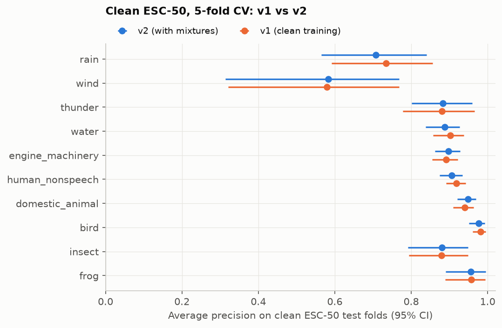
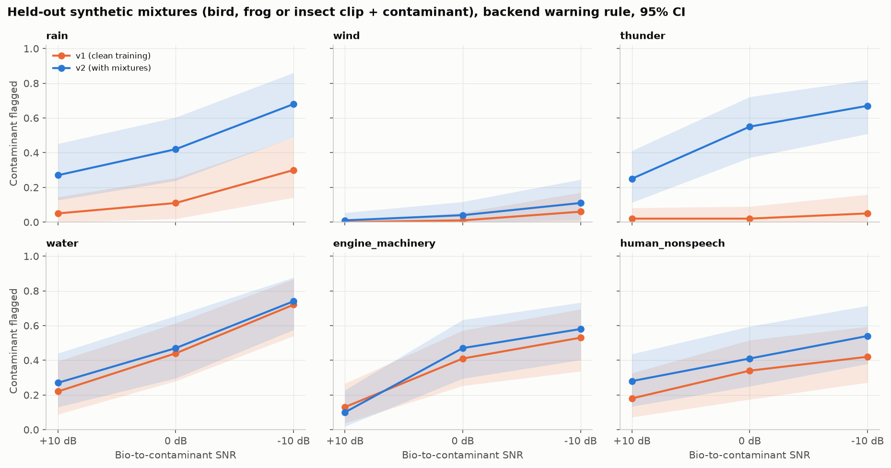
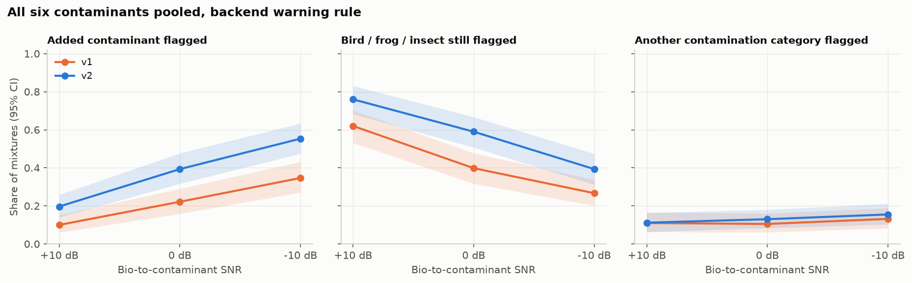

# Soundscape QC head v2 (mixture training) on ESC-50: evaluation report

Generated by `ml/train/esc50_qc_mix.py` (text by `ml/train/esc50_qc_mix_report.py`). Every number comes from `ml/reports/qc_esc50_v2_results.json` (v2, called v2b below) or `ml/reports/qc_esc50_v2a_results.json` (the first attempt), which also store the settings. v1 is described in `ml/reports/qc_esc50_v1.md`.

**The mixtures in this report are synthetic.** Each one adds two curated ESC-50 clips digitally. They are not field recordings; real overlap has distance, reverberation and recorder noise that these mixtures do not have.

## Summary

* Decision: v2 does not meet the ship criteria written down before the results (table below), so v1 stays the default.
* A first attempt (v2a, union labels, equal weights) flagged far more contaminants under calls but lost clean accuracy and failed the criteria; v2 (v2b) keeps mixture training only where it does not cost clean accuracy. v2b was designed after seeing v2a's results (see the honesty note).
* Clean ESC-50 test folds: macro AP v1 0.866 (0.834 to 0.894), v2 0.863 (0.832 to 0.890); difference -0.004 (-0.015 to 0.008). Macro F1 v1 0.800 (0.766 to 0.827), v2 0.722 (0.694 to 0.742); difference -0.079 (-0.104 to -0.051).
* Held-out mixtures (a bird, frog or insect clip plus one of six contaminants, backend warning rule): the added contaminant is flagged at +10 dB by v1 in 10% (6 to 15) and v2 in 20% (14 to 26), 0 dB by v1 in 22% (16 to 29) and v2 in 39% (32 to 48), -10 dB by v1 in 35% (27 to 43) and v2 in 55% (47 to 63) of mixtures.
* Gain in detection (v2 minus v1, same mixtures): +10 dB +10 points (+6 to +15), 0 dB +17 points (+11 to +24), -10 dB +21 points (+14 to +28).
* False contamination warnings on clean bird, frog and insect test clips (backend rule): v1 12% (7 to 18), v2 11% (6 to 16); difference -1 points (-5 to +3).
* The mixtures are synthetic: two curated ESC-50 clips added together. They are not field recordings, and these are not field accuracy numbers.

## Ship criteria (set before the results)

The criteria were written into `esc50_qc_mix.py` before v2 was evaluated. Detection gains use the backend warning rule (score above max(0.5, threshold)).

| Criterion | Value | Pass |
|---|---|---|
| Lower end of the 95% CI of clean macro AP difference (v2 minus v1) is at least -0.02 | -0.015 | yes |
| Clean macro AP difference is at least -0.01 | -0.004 | yes |
| Clean macro F1 difference is at least -0.02 | -0.079 | no |
| Detection gain at 0 dB: lower end of 95% CI above 0 | +0.107 | yes |
| Detection gain at -10 dB: lower end of 95% CI above 0 | +0.140 | yes |
| Increase in false contamination warnings on clean bird, frog and insect clips is at most 0.05 | -0.010 | yes |

Result: **do not ship**.

## How v2 was built (two attempts)

* **Mixtures, built inside each ESC-50 fold.** Both clips of a mixture come from the same official fold, so no source recording is shared between training and test mixtures (checked in code). For each fold: 400 training-pool mixtures (2000 in total) and an evaluation set (1800 in total), embedded once with BirdNET exactly like v1 (3 s windows, 1 s hop, mean and max pooling; sha256 `55f3e4055b1a13bf...`).
* **Training pool.** Base clip category drawn with weights bird 0.25, insect 0.25, frog 0.2, domestic_animal 0.15, human_nonspeech 0.15; contaminant category drawn uniformly from rain, wind, thunder, water, engine_machinery, human_nonspeech (never the base's own category); a random clip of each; signal-to-noise ratio uniform in -10 to +15 dB.
* **Evaluation set.** Every bird, frog and insect clip of the fold, each mixed with 3 contaminant categories (rotating over the six) at each of +10, 0 and -10 dB: 100 mixtures per contaminant and ratio. These mixtures are never used for training or for any choice.
* **Signal-to-noise ratio.** Active RMS (50 ms frames above -80 dBFS, which skips ESC-50's digital-silence padding) of the base clip vs the contaminant clip over the 5 s clip. A negative value means the contaminant is louder.

**Attempt 1 (v2a): union labels, clean and mixtures weighted equally.** Labels were the union of both clips' categories at any ratio, and one C (chosen from [0.01, 0.03, 0.1, 0.3]) was shared by all categories. On held-out mixtures it flagged the contaminant far more often than v1 (gain +10 dB +17 points (+12 to +23), 0 dB +26 points (+18 to +33), -10 dB +23 points (+15 to +31)), but it got clearly worse on clean clips: macro AP difference -0.072 (-0.096 to -0.049), macro F1 difference -0.128 (-0.157 to -0.098), false contamination warnings on clean bird, frog and insect clips +9 points (+2 to +17). It failed the pre-registered criteria (4 of 6 checks failed) and was not shipped. Its full results are in `qc_esc50_v2a_results.json`.

**Diagnosis on training data only.** To choose a fix without touching outer test fold 1, we trained on three of folds 2 to 5 and validated on the fourth (fold 2, then fold 3), comparing recipes at two C values. Clean and mixture macro AP on the validation fold (mixtures scored with SNR up to +10 dB):

| Validation fold | Recipe | C | Clean macro AP | Mixture macro AP |
|---|---|---|---|---|
| 2 | clean_only | 0.01 | 0.908 | 0.770 |
| 2 | clean_only | 0.1 | 0.904 | 0.761 |
| 2 | union_w1 | 0.01 | 0.841 | 0.814 |
| 2 | union_w1 | 0.1 | 0.798 | 0.790 |
| 2 | union_w0.25 | 0.01 | 0.861 | 0.818 |
| 2 | union_w0.25 | 0.1 | 0.834 | 0.794 |
| 2 | gated_w1 | 0.01 | 0.845 | 0.790 |
| 2 | gated_w1 | 0.1 | 0.826 | 0.743 |
| 2 | gated_w0.25 | 0.01 | 0.877 | 0.807 |
| 2 | gated_w0.25 | 0.1 | 0.844 | 0.764 |
| 3 | clean_only | 0.01 | 0.796 | 0.680 |
| 3 | clean_only | 0.1 | 0.801 | 0.670 |
| 3 | union_w1 | 0.01 | 0.723 | 0.715 |
| 3 | union_w1 | 0.1 | 0.692 | 0.690 |
| 3 | union_w0.25 | 0.01 | 0.751 | 0.725 |
| 3 | union_w0.25 | 0.1 | 0.726 | 0.700 |
| 3 | gated_w1 | 0.01 | 0.744 | 0.708 |
| 3 | gated_w1 | 0.1 | 0.714 | 0.682 |
| 3 | gated_w0.25 | 0.01 | 0.777 | 0.714 |
| 3 | gated_w0.25 | 0.1 | 0.749 | 0.690 |

Every mixture recipe cost some clean AP; audibility-gated labels and a lower mixture weight cost the least, and smaller C helped. A single linear head cannot fully serve both clean clips and mixtures, so the fix below chooses, per category, whether mixture training is worth its clean cost.

**Attempt 2 (v2b, the v2 that is evaluated below).** (1) Audibility-gated training labels: the contaminant counts as present only if it is at most 10 dB below the base, and the base only if it is at most 5 dB below the contaminant. (2) For each category separately, the training recipe (mixture weight 0.0, 0.1, 0.25, 0.5, where 0 means clean clips only) and C (from [0.003, 0.01, 0.03, 0.1]) are chosen by leave-one-fold-out inside the training folds: a (recipe, C) pair is allowed only if its clean AP is within 0.01 of the best clean-only AP for that category, and among allowed pairs the best AP on clean clips and mixtures together wins. (3) Platt scaling and thresholds are fit on the out-of-fold predictions for clean clips and gated-label mixtures. (4) The per-category models are merged into one standardization, so the file format is exactly v1's.

**Honesty note.** v2b was designed after we had seen v2a's test-fold results, and the diagnosis above used folds that are test folds in other rotations. Its recipe candidates are therefore not a fully blind choice, and its test numbers may be slightly optimistic. The ship criteria were not changed.

Recipe and C chosen per category in each outer fold (recipe name, then C):

| Category | Fold 1 | Fold 2 | Fold 3 | Fold 4 | Fold 5 |
|---|---|---|---|---|---|
| `rain` | w0.1/C=0.03 | w0.25/C=0.01 | w0.1/C=0.03 | w0.5/C=0.003 | clean_only/C=0.1 |
| `wind` | clean_only/C=0.003 | clean_only/C=0.003 | clean_only/C=0.01 | clean_only/C=0.03 | clean_only/C=0.003 |
| `thunder` | w0.5/C=0.01 | w0.25/C=0.01 | w0.25/C=0.01 | w0.1/C=0.03 | w0.25/C=0.01 |
| `water` | w0.1/C=0.03 | clean_only/C=0.01 | w0.1/C=0.03 | clean_only/C=0.003 | w0.25/C=0.003 |
| `engine_machinery` | w0.1/C=0.003 | w0.25/C=0.003 | w0.25/C=0.003 | w0.25/C=0.003 | w0.5/C=0.003 |
| `human_nonspeech` | w0.25/C=0.01 | w0.1/C=0.01 | w0.1/C=0.01 | clean_only/C=0.01 | w0.1/C=0.01 |
| `domestic_animal` | w0.5/C=0.003 | w0.1/C=0.03 | w0.25/C=0.01 | w0.5/C=0.003 | w0.25/C=0.01 |
| `bird` | w0.1/C=0.003 | w0.25/C=0.003 | w0.1/C=0.003 | w0.1/C=0.003 | w0.1/C=0.003 |
| `insect` | clean_only/C=0.003 | w0.25/C=0.003 | w0.1/C=0.003 | w0.1/C=0.003 | w0.25/C=0.003 |
| `frog` | w0.1/C=0.003 | w0.1/C=0.003 | w0.1/C=0.003 | clean_only/C=0.1 | w0.1/C=0.003 |

* **Protocol.** For test fold k, everything above runs on the clean clips and training-pool mixtures of the other four folds only. The model is then tested on fold k's clean clips, its training-pool mixtures and its evaluation mixtures. v1 numbers come from the saved v1 fold models on the same data, so comparisons are paired.
* **Uncertainty.** Clean clips: cluster bootstrap over source recordings, as in v1. Mixtures: a two-way ('pigeonhole') bootstrap that resamples base-clip sources and contaminant-clip sources independently, because each clip appears in several mixtures. 1000 resamples; 95% percentile intervals.

## Why v2 was not shipped

Failed check(s): clean_macro_f1_diff_point. v2's clean ranking is as good as v1's (macro AP difference -0.004 (-0.015 to 0.008)), but its own F1 thresholds flag too much on clean clips: macro precision falls from 0.802 (0.764 to 0.835) to 0.634 (0.606 to 0.657) while recall rises from 0.800 (0.764 to 0.835) to 0.884 (0.857 to 0.909). Clips flagged per category at those thresholds (v1 then v2): rain 40 then 71, wind 34 then 162, thunder 41 then 75, water 158 then 178, engine_machinery 425 then 445, human_nonspeech 389 then 478, domestic_animal 301 then 292, bird 75 then 97, insect 80 then 112, frog 41 then 62.

The likely cause is a base-rate shift: Platt scaling and thresholds were fit on clean clips and mixtures together, where contamination is far more common than in the clean set, so v2's probabilities run high on clean clips (expected calibration error 0.004 for v1, 0.024 for v2). Under the backend's own warning rule (score above max(0.5, threshold)) the clean macro F1 is similar: v1 0.792 (0.755 to 0.820), v2 0.795 (0.763 to 0.820) (precision 0.854 (0.815 to 0.885) vs 0.796 (0.760 to 0.826), recall 0.745 (0.707 to 0.782) vs 0.801 (0.765 to 0.835)).

We did not change the criterion after seeing this. The pre-registered check uses each model's own F1 thresholds, and v2 fails it. v1 stays the default and no v2 file is written to the backend. A sensible next step is to fit v2's calibration and thresholds on clean out-of-fold predictions (or to reweight to a field base rate), and then to confirm on data not used here, ideally the field gold set (`ml/eval/gold_benchmark.py`). Re-testing on these ESC-50 folds after a third round of changes would make the estimate too optimistic.

## (a) Clean ESC-50 test folds

| Category | AP v1 | AP v2 | AP difference | F1 v1 | F1 v2 |
|---|---|---|---|---|---|
| `rain` | 0.734 (0.592 to 0.856) | 0.708 (0.565 to 0.840) | -0.026 (-0.064 to 0.014) | 0.700 (0.583 to 0.800) | 0.559 (0.440 to 0.655) |
| `wind` | 0.580 (0.321 to 0.769) | 0.583 (0.314 to 0.769) | 0.003 (-0.061 to 0.065) | 0.486 (0.270 to 0.659) | 0.317 (0.205 to 0.438) |
| `thunder` | 0.881 (0.779 to 0.965) | 0.883 (0.801 to 0.959) | 0.002 (-0.056 to 0.073) | 0.815 (0.697 to 0.909) | 0.661 (0.521 to 0.765) |
| `water` | 0.903 (0.858 to 0.938) | 0.888 (0.838 to 0.927) | -0.015 (-0.028 to -0.002) | 0.824 (0.770 to 0.871) | 0.799 (0.736 to 0.852) |
| `engine_machinery` | 0.891 (0.855 to 0.921) | 0.898 (0.863 to 0.928) | 0.007 (-0.006 to 0.022) | 0.829 (0.795 to 0.861) | 0.819 (0.781 to 0.849) |
| `human_nonspeech` | 0.918 (0.891 to 0.942) | 0.906 (0.874 to 0.934) | -0.012 (-0.025 to -0.001) | 0.849 (0.821 to 0.875) | 0.820 (0.787 to 0.851) |
| `domestic_animal` | 0.940 (0.910 to 0.963) | 0.948 (0.921 to 0.969) | 0.008 (-0.004 to 0.024) | 0.881 (0.849 to 0.910) | 0.874 (0.838 to 0.905) |
| `bird` | 0.982 (0.961 to 0.994) | 0.977 (0.951 to 0.992) | -0.005 (-0.015 to 0.003) | 0.916 (0.857 to 0.963) | 0.893 (0.833 to 0.947) |
| `insect` | 0.879 (0.794 to 0.948) | 0.880 (0.792 to 0.949) | 0.001 (-0.025 to 0.028) | 0.812 (0.722 to 0.885) | 0.729 (0.626 to 0.806) |
| `frog` | 0.957 (0.888 to 0.994) | 0.956 (0.890 to 0.995) | -0.001 (-0.027 to 0.028) | 0.889 (0.778 to 0.963) | 0.745 (0.588 to 0.842) |
| **macro** | 0.866 (0.834 to 0.894) | 0.863 (0.832 to 0.890) | -0.004 (-0.015 to 0.008) | 0.800 (0.766 to 0.827) | 0.722 (0.694 to 0.742) |
| **micro** | 0.908 (0.893 to 0.922) | 0.899 (0.884 to 0.911) | | 0.837 (0.819 to 0.853) | 0.781 (0.765 to 0.796) |

At the backend warning rule: macro precision v1 0.854 (0.815 to 0.885), v2 0.796 (0.760 to 0.826); macro recall v1 0.745 (0.707 to 0.782), v2 0.801 (0.765 to 0.835). Expected calibration error (all category-clip pairs): v1 0.004, v2 0.024.

False contamination flags on the 200 clean bird, frog and insect test clips: F1 thresholds v1 14% (8 to 20), v2 30% (24 to 37); backend rule v1 12% (7 to 18), v2 11% (6 to 16).



## (b) Held-out mixtures at fixed signal-to-noise ratios

Share of evaluation mixtures where the added contaminant is flagged (backend warning rule), 100 mixtures per cell:

| Contaminant | SNR | v1 | v2 | Gain (v2 minus v1) |
|---|---|---|---|---|
| `rain` | +10 dB | 5% (0 to 14) | 27% (13 to 45) | +22 points (+8 to +39) |
| `rain` | 0 dB | 11% (2 to 26) | 42% (24 to 60) | +31 points (+16 to +48) |
| `rain` | -10 dB | 30% (14 to 49) | 68% (49 to 86) | +38 points (+21 to +56) |
| `wind` | +10 dB | 0% (0 to 0) | 1% (0 to 5) | +1 points (+0 to +5) |
| `wind` | 0 dB | 1% (0 to 5) | 4% (0 to 12) | +3 points (+0 to +11) |
| `wind` | -10 dB | 6% (0 to 17) | 11% (1 to 25) | +5 points (+0 to +13) |
| `thunder` | +10 dB | 2% (0 to 8) | 25% (11 to 41) | +23 points (+10 to +39) |
| `thunder` | 0 dB | 2% (0 to 9) | 55% (37 to 72) | +53 points (+36 to +71) |
| `thunder` | -10 dB | 5% (0 to 16) | 67% (51 to 82) | +62 points (+47 to +78) |
| `water` | +10 dB | 22% (9 to 39) | 27% (13 to 44) | +5 points (-2 to +15) |
| `water` | 0 dB | 44% (28 to 61) | 47% (30 to 66) | +3 points (-9 to +16) |
| `water` | -10 dB | 72% (54 to 87) | 74% (57 to 88) | +2 points (-6 to +12) |
| `engine_machinery` | +10 dB | 13% (4 to 27) | 10% (2 to 23) | -3 points (-12 to +3) |
| `engine_machinery` | 0 dB | 41% (25 to 57) | 47% (29 to 63) | +6 points (-2 to +17) |
| `engine_machinery` | -10 dB | 53% (34 to 69) | 58% (40 to 73) | +5 points (-7 to +16) |
| `human_nonspeech` | +10 dB | 18% (7 to 33) | 28% (13 to 44) | +10 points (+0 to +23) |
| `human_nonspeech` | 0 dB | 34% (17 to 52) | 41% (25 to 59) | +7 points (-1 to +18) |
| `human_nonspeech` | -10 dB | 42% (27 to 59) | 54% (38 to 71) | +12 points (+3 to +25) |
| all six | +10 dB | 10% (6 to 15) | 20% (14 to 26) | +10 points (+6 to +15) |
| all six | 0 dB | 22% (16 to 29) | 39% (32 to 48) | +17 points (+11 to +24) |
| all six | -10 dB | 35% (27 to 43) | 55% (47 to 63) | +21 points (+14 to +28) |

Contaminants whose detection gain has a 95% CI above zero: +10 dB: rain, thunder; 0 dB: rain, thunder; -10 dB: rain, thunder, human_nonspeech.

Side effects on the same mixtures (all six contaminants pooled):

| SNR | Bird / frog / insect still flagged, v1 | v2 | Another contamination category also flagged, v1 | v2 |
|---|---|---|---|---|
| +10 dB | 62% (53 to 70) | 76% (68 to 83) | 11% (6 to 17) | 11% (6 to 16) |
| 0 dB | 40% (32 to 48) | 59% (51 to 67) | 10% (6 to 16) | 13% (8 to 18) |
| -10 dB | 27% (20 to 34) | 39% (31 to 47) | 13% (8 to 19) | 16% (10 to 21) |

With the F1 thresholds instead of the backend rule, detection (all six pooled) is: +10 dB v1 12% (8 to 18), v2 31% (24 to 38), 0 dB v1 26% (20 to 33), v2 57% (50 to 65), -10 dB v1 41% (33 to 50), v2 70% (64 to 77).





Multi-label average precision on the test folds' training-pool mixtures (2000 mixtures, random ratios, bases include domestic animals and human sounds; bootstrap over base-clip sources): macro AP v1 0.692 (0.675 to 0.710), v2 0.730 (0.715 to 0.747). Per category (v1 / v2): rain 0.71 / 0.72, wind 0.39 / 0.42, thunder 0.58 / 0.72, water 0.64 / 0.67, engine_machinery 0.44 / 0.48, human_nonspeech 0.73 / 0.74, domestic_animal 0.73 / 0.79, bird 0.94 / 0.95, insect 0.84 / 0.88, frog 0.92 / 0.93.

Scored with audibility-gated labels instead: macro AP v1 0.640 (0.623 to 0.660), v2 0.673 (0.657 to 0.691).

For context, BirdNET's matching-taxon label reaches 0.6 on the evaluation mixtures in: +10 dB: bird 63%, frog 37%, insect 6%; 0 dB: bird 51%, frog 31%, insect 7%; -10 dB: bird 34%, frog 22%, insect 3%.

## Long recordings (synthetic, clean windows)

Same check as v1 (30 s and 60 s recordings built from test-fold clips; bird, insect and frog background; backend rule). Detection is the mean over the 7 contamination categories.

| Model | Pooling | Detected, 1 of 6 clips | 3 of 6 | 6 of 6 | False warning, 30 s | 60 s |
|---|---|---|---|---|---|---|
| v1 | `whole` | 3% | 16% | 82% | 9% | 17% |
| v1 | `segment_max` | 73% | 94% | 96% | 48% | 80% |
| v1 | `segment_top25` | 5% | 80% | 93% | 5% | 1% |
| v2 | `whole` | 6% | 25% | 94% | 13% | 34% |
| v2 | `segment_max` | 78% | 98% | 100% | 52% | 79% |
| v2 | `segment_top25` | 6% | 86% | 98% | 6% | 1% |

The shipped head (v1) uses `segment_top25` (a category must be present in about a quarter of the 6 s segments); a v2 file would use the same rule.

## Limitations

* All mixtures are synthetic sums of two close-range ESC-50 clips. Real overlap in the field (distance, reverberation, several sources, recorder noise) is not represented, so these gains may not carry over in full.
* Training and test mixtures reuse the same few clips many times (for example 8 rain clips per fold); the two-way bootstrap accounts for this, but a small clip pool still limits how general the result is.
* Detection still depends strongly on the ratio and the contaminant: the weakest case for v2 is `wind` at -10 dB (11% (1 to 25)).
* v2b's training labels use an audibility gate (+10 / -5 dB) set by judgment, not by listening tests; real listeners may hear or miss quiet sources differently.
* Everything in v1's limitations still applies: ESC-50 is not field audio, `bird`, `insect` and `frog` scores are not validated for users, short bursts are not flagged at the recording level, and no field validation has been done.

## Reproduce

```
python ml/train/esc50_qc.py features --data /home/claude/data/esc50   # v1 features, if not cached
python ml/train/esc50_qc.py evaluate --data /home/claude/data/esc50   # v1 fold models (paired baseline)
python ml/train/esc50_qc_mix.py all --data /home/claude/data/esc50
# = mixfeatures, evaluate --variant v2a, diagnose, evaluate --variant v2b, export (only if the criteria pass), smoke, report
```

Mixture embedding took 11.5 min and evaluation 21.5 min on 2 vCPU. Seed 20260926.
